```{r, echo=F, warnings=F}
knitr::opts_chunk$set(
    fig.align = "center"
)
```

```{css, echo=F}
.speaker-note {
    background-color: #fff8e1;
    border-left: 4px solid #f9a825;
    padding: 10px 14px;
    margin: 14px 0;
    border-radius: 3px;
    font-size: 0.92em;
    color: #5d4037;
}

.speaker-note::before {
    content: "🗒 Facilitator note: ";
    font-weight: bold;
}
```
::: speaker-note
**Session overview and timing (3 hours total)**

This session introduces spatial infectious disease models and is designed for participants who have spent the previous 2--3 days working with heterogeneous well-mixed models. The session builds directly on that foundation by adding space as a further dimension of heterogeneity.

The session is structured in three parts of roughly 60 minutes each:

**Part 1: Continuous space and travelling waves (~60 min)**

- Why space matters and motivating examples: ~15 min. Opens with discussion question 1.1 --- allow 3--5 minutes for participants to discuss in pairs before taking responses.
- Reaction-diffusion equations and schematic: ~10 min. Focus on intuition for the diffusion term; do not get drawn into PDE detail.
- Wavespeed formula: ~10 min. Walk through term by term; ask participants to reason through question 1.3 before revealing the algebra.
- Cellular automata as a bridge, and further reading: ~5 min. Signpost only.
- R practical (questions 1.5--1.8): ~20 min. Participants run the code first, then experiment. Question 1.8 is optional extension.

**Part 2: Metapopulation models (~60 min)**

- From continuous to patchy space, commuter framework, and figures: ~20 min. Spend time on the double-subscript notation before moving to equations --- the schematic figure is your main tool here.
- Coupling strength, synchrony, and mobility models: ~15 min. The synchrony result is the most important practical takeaway; use the pre-generated figure to illustrate it.
- R practical (questions 2.5--2.9): ~25 min. Questions 2.5--2.7 are the core; question 2.9 (border closure) makes a good whole-group debrief if time allows.

**Part 3: Network models and synthesis (~60 min)**

- From metapopulation to network, network types, and effective distance: ~20 min. The network figure and effective distance schematic are your main visual aids.
- R practical (questions 3.3--3.6): ~20 min. Remind participants this is stochastic --- different runs are expected. Question 3.6 (seeding on a hub) works well as a live group demonstration.
- Decision framework table, scenario questions 3.7--3.8, and what we have not covered: ~20 min. Questions 3.7 and 3.8 work well as pair or small group discussions before whole-group debrief.

**General notes:**

- All R practicals assume `deSolve`, `igraph`, and `ggplot2` are installed. Check this before the session.
- Speaker notes throughout the document provide additional context, common points of confusion, and suggested discussion prompts for each section.
- The student-facing version (without speaker notes) can be produced by changing `.speaker-note { display: block; }` to `.speaker-note { display: none; }` in `style_training.css` and re-rendering.
- Figure files (fig1--fig6 PNG files) must be in the same directory as the qmd for the document to render correctly.
:::

# Summary {.tabset .tabset-pills .tabset-fade}

This is an interactive session introducing spatial infectious disease models. We will explore why and when spatial structure matters, and work through three broad families of spatial model, each demonstrated in R.

This session is divided into three parts:

**Part 1** covers:

-   Why space matters: motivating examples
-   Continuous space and reaction-diffusion models
-   Travelling waves and the wavespeed formula
-   Cellular automata as a conceptual bridge
-   R practical: visualising a travelling wave

**Part 2** covers:

-   Metapopulation models: concepts and equations
-   The commuter framework
-   Coupling strength, synchrony, and public health implications
-   Human mobility models: gravity and radiation
-   R practical: a two-patch SIR model

**Part 3** covers:

-   From metapopulation to network
-   Network structure and epidemic dynamics
-   Effective distance and the hidden geometry of spread
-   R practical: SIR on a network

**Part 4** is a synthesis and summary of the session:

-   When to use which type of spatial model
-   What we have not covered

**Bonus** Spatial risk mapping:

Bonus materials for those interested in spatial risk mapping in particular, not expected to be covered during the 3 hours.

- From dynamic disease transmission models to spatial risk
- Species distribution models
- Bridging disease dynamics and ecology

*We recommend saving your text at the end of each part by printing the file.*

---

# **Part 1:** Continuous space and travelling waves

## Why does space matter?

::: speaker-note
Open with the central tension: participants have spent the course so far building well-mixed models. The goal of this opener is to make them feel the limitation viscerally before introducing the mathematics. The three examples below are chosen to span disease types --- vector-borne, respiratory, and livestock --- so there is likely something relevant to everyone in the room. Spend a couple of minutes on the comparison figure, making sure participants can articulate *what is different* between the two panels before moving on. The key answer you are drawing out: a non-spatial model tells you *whether* an epidemic happens and *how big* it gets; a spatial model tells you *where* and *how fast*. Those are different questions requiring different tools.
:::

Over the past few days you have seen how the well-mixed assumption breaks down when populations differ by age, risk group, or species. Space is another dimension of heterogeneity, and one that interacts with all the others. A model that is well-mixed within a city may not be well-mixed across a country. Consider:

-   The spread of dengue fever across SE Asia, driven by a combination of *Aedes aegypti* mosquito locations and abundance, and the urban/rural and island/mainland patchiness
-   An influenza outbreak moving progressively from city to city along transport corridors
-   Foot-and-mouth disease spreading farm to farm across the UK countryside

In each of these cases, *where* individuals or vectors are located changes the dynamics in ways that a non-spatial model would miss entirely. Spatial models let us ask questions like: how fast does a disease spread geographically? Will it reach a given city? If we intervene in one region, what effect does that have on neighbouring regions?

The figure below illustrates this difference. On the left, a non-spatial SIR model produces a single epidemic curve for the whole population. On the right, a spatial model at the same time point shows the infection as a wave moving across a landscape --- information that the non-spatial model simply cannot capture.

<center>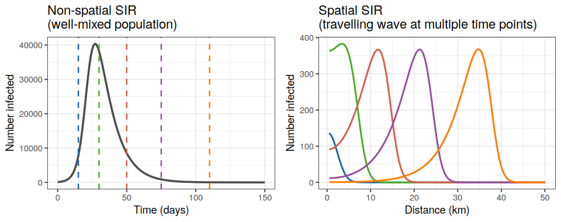</center>

<p><br></p>

There is no single "spatial model" --- the right approach depends on the biology of the host, the nature of movement, and the question being asked. Riley (2007) provides a useful taxonomy of how space can be incorporated, ranging from patch models through to continuous space:

<center>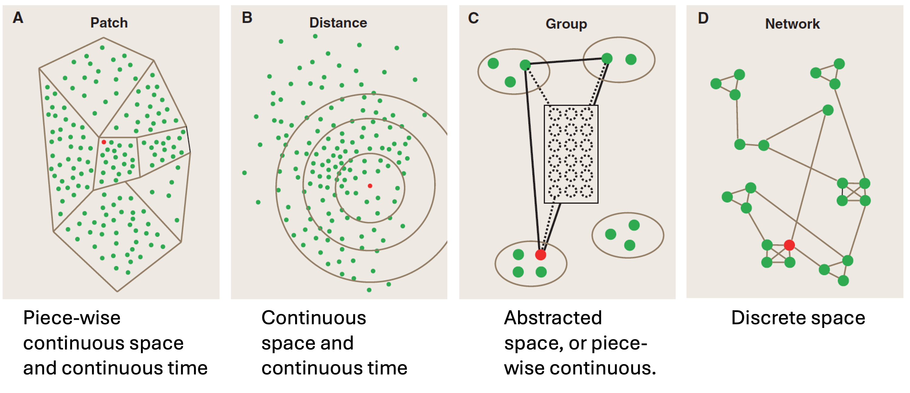</center>

::: speaker-note
The Riley (2007) figure referenced below (Figure 1 in that paper) is the clearest single-image summary of spatial modelling approaches I've found yet in the literature. The four panels show: (A) patch/metapopulation, (B) distance-based continuous space, (C) group/abstracted space, and (D) discrete network. The full citation is: Riley, S. (2007). Large-scale spatial-transmission models of infectious disease. *Science*, 316, 1298--1301. In this session we cover approaches B then C then D, only briefly touching on A as a conceptual bridge between B and C.
:::

> Riley, S. (2007). Large-scale spatial-transmission models of infectious disease. *Science*, 316, 1298--1301. [https://doi.org/10.1126/science.1134695](https://doi.org/10.1126/science.1134695) — Figure 1 of this paper is a useful reference overview of the four main ways space is represented in epidemic models (patch, distance, group, network).

In this session we will cover three broad families, moving from continuous space (B) through to metapopulation (C) then explicit networks (D).

**1.1 Think of an infectious disease that is relevant to your context or research. Can you think of a reason why space might matter for that disease? What question might you want to ask that a non-spatial model could not answer?**

```{=html}
<textarea cols="127" rows="4"></textarea>
```
<p><br></p>

---

## Reaction-diffusion models: continuous space

::: speaker-note
The reaction-diffusion model is introduced primarily as a conceptual foundation and to motivate the wavespeed result, not because participants will use it routinely (depending on their questions). The key messages to convey are: (1) the Laplacian term $\nabla^2$ is just "am I gaining or losing individuals to my neighbours?"; (2) the model produces a travelling wave, which is a real, observable phenomenon for some diseases; and (3) it tends to breaks down for modern human diseases because of long-range travel. Do not get bogged down in the PDE notation if participants find it intimidating: the schematic figure below is more important than the equations for building intuition. It is fine to say "this is a partial differential equation; the key idea is the $D\nabla^2$ term, which represents diffusion. If people are really stuck, you could make a cup of tea to help visualise this (noting that there *will* be some advection, from adding the tea bag)."
:::

The simplest way to add space to an SIR model is to imagine individuals moving randomly through a continuous landscape, like molecules diffusing in a liquid (e.g. when making tea without stirring, you see the colour spread). This is a **reaction-diffusion** model: the "reaction" is infection and recovery (as in a standard SIR), and the "diffusion" describes random movement.

<!-- todo: it may be worth moving from  S(\ell, t) etc to e.g. X(\ell, t) (and I->Y, R->Z, N-> something else) to further emphasise that X != S, but S(t)=\int_x X(\ell, t) d \ell.  -->
Let $S(\ell, t)$, $I(\ell, t)$, $R(\ell, t)$ be the *density* of susceptibles, infecteds, and recovereds at location $\ell$ and time $t$, where the total *density* in a given location and time is $N(\ell, t)=S(\ell, t)+I(\ell, t)+R(\ell, t)$. We use $\ell$ only for font-based reasons of clarity. The model equations are then

$$\frac{\partial S}{\partial t} = -\frac{\beta S I}{N} + D\nabla^2 S$$

$$\frac{\partial I}{\partial t} = \frac{\beta S I}{N} - \gamma I + D\nabla^2 I$$

$$\frac{\partial R}{\partial t} = \gamma I + D\nabla^2 R$$

where $D$ is the **diffusion coefficient** (how fast individuals move), and $\nabla^2$ is the Laplacian operator --- in one spatial dimension this is simply $\frac{\partial^2}{\partial \ell^2}$, the second spatial derivative.

The figure below shows how to think about this numerically: space is divided into cells, each running its own local SIR dynamics, while the diffusion term moves individuals between neighbouring cells.

<center>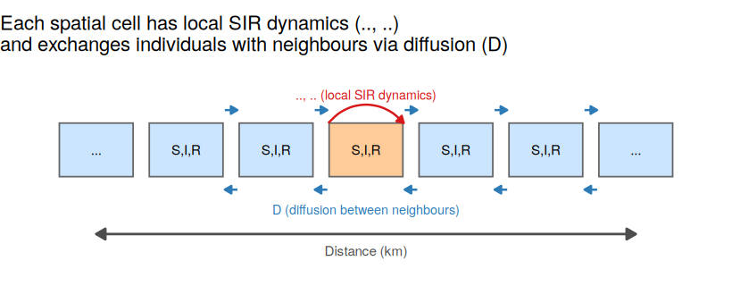</center>

<p><br></p>

The diffusion term $D\nabla^2 I$ says that the infected density at any point changes not just due to local transmission and recovery, but also due to movement of infecteds *into* and *out of* that location from neighbouring locations.

**1.2 In the equation for $\frac{\partial S}{\partial t}$, what does the term $D \nabla^2 S$ represent biologically? What would happen to the epidemic if $D = 0$?**

```{=html}
<textarea cols="127" rows="4"></textarea>
```
<p><br></p>

::: {.panel-tabset}
## Overview

The model as written uses a single spatial dimension $\ell$. The sections below give additional mathematical detail for those who want it.

## Technical note: 2D and demography

### Extending to two spatial dimensions

The location $\ell$ can represent a position in any coordinate system. The two most common choices are:

If $\ell = (x, y)$ in **2D Cartesian coordinates**:

$$\nabla^2 S = \frac{\partial^2 S}{\partial x^2} + \frac{\partial^2 S}{\partial y^2}$$

If $\ell = (r, \theta)$ in **polar coordinates**, and assuming spread is symmetric in $\theta$:

$$\nabla^2 S = \frac{1}{r} \frac{\partial}{\partial r}\left(r \frac{\partial S}{\partial r}\right) + \frac{1}{r^2} \frac{\partial^2 S}{\partial \theta^2}$$

The symmetry assumption (spread equal in all directions from a point source) causes the second term to vanish and is the assumption used to derive the wavespeed result below.

The population constraint $S + I + R = N$ holds at every location $\ell$ and time $t$ regardless of coordinate system.

### Including demography

Births and deaths are still proportional to the local population, and so 

$$\frac{\partial S}{\partial t} = vN - \frac{\beta SI}{N} - \mu S + D \nabla^2 S$$

$$\frac{\partial I}{\partial t} = \frac{\beta SI}{N} - (\gamma + \mu)I + D \nabla^2 I$$

$$\frac{\partial R}{\partial t} = \gamma I - \mu R + D \nabla^2 R$$

where $v$ is the per-capita birth rate and $\mu$ is the per-capita death rate, both applied to the local population density at $\ell$.

### Equal movement

We have assumed everyone moves (diffuses) at the same rate, but a different diffusion coefficient could be used, for example if those infectious have their movement decreased.

:::

---

## Travelling waves

::: speaker-note
The wavespeed formula is the main analytical take-away from this section. Walk through it term by term: $D$ is mobility, $(\mathcal{R}_0 - 1)$ is how far above the epidemic threshold we are, and $\gamma$ sets the timescale of the disease. The key public health point, halving $\mathcal{R}_0$ is more effective than halving $D$ for slowing spread, is worth emphasising and asking participants to reason through. Use the provided figure to help explain the solutions to the questions below. 

It may also be worth noting that a travelling wave does not always form/exist: it depends on the reaction vs the diffusion rates.
:::

A striking property of reaction-diffusion SIR models is that they produce **travelling waves**: a front of infection sweeps across space at a roughly constant speed, leaving recovered individuals behind it (as we saw in Figure 1). You can see this historically in data, for example diseases spreading across Europe in a wave-like pattern before modern transport or vaccinations (e.g. the figure below), or [foot and mouth spread through the UK](http://www.theguardian.com/footandmouth/flash/0,7365,443772,00.html){target="_blank"}. Though we note with modern transportation systems, these travelling waves tend not to form so much in human disease spread [(see Cliff and Haggett (2004), for example).](https://doi.org/10.1093/bmb/ldh011){target="_blank"}

<center>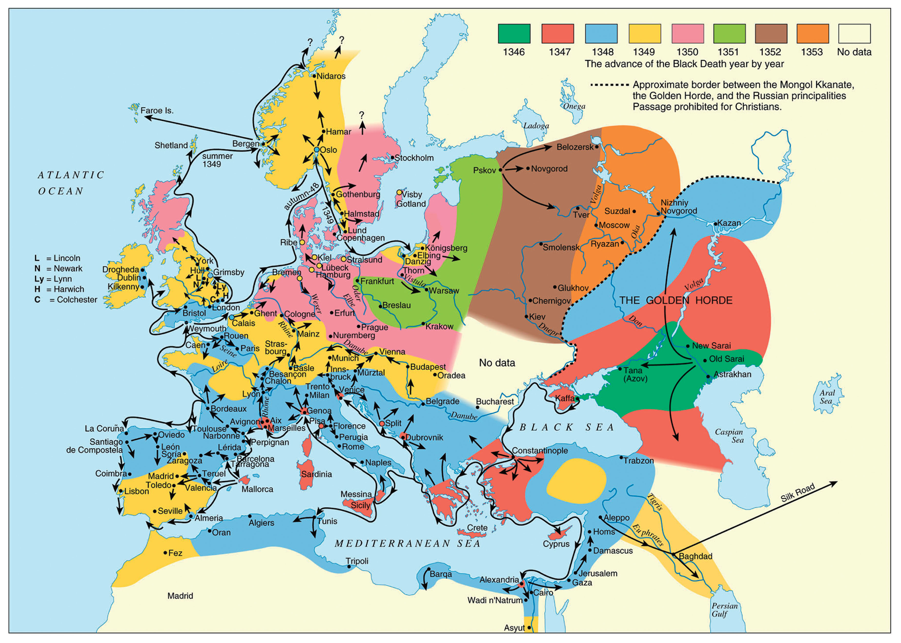</center>
> [Cesana et al.)](https://doi.org/10.1537/ase.161011){target="_blank"} show a travelling wave like pattern for the spread of the Black Death across Europe in the 14th Century. 

With some mathematical analysis (using an [*ansatz*, an assumed form for the solution not based on any underlying theory or principle,](http://mathworld.wolfram.com/Ansatz.html){target="_blank"} in this case that $z=x-ct$, so that now $S(\ell,t)=\hat{S}(z)$, etc), it can be shown that the minimum wavespeed $c$ is

$$c = 2\sqrt{D(\beta - \gamma)} = 2\sqrt{D(\mathcal{R}_0 - 1)\gamma}$$

where $\mathcal{R}_0 = \beta/\gamma$ is the basic reproduction number.

Having this explicit expression for the wavespeed also means we can explore the spatial effects, like those shown in Figure 1, without fully solving the system numerically. Instead we can direclty solve for the wavespeed and computationally quickly arrive at figures showing how it is affected by different model parameters (like $D$ and $\mathcal{R}_0$).

<center>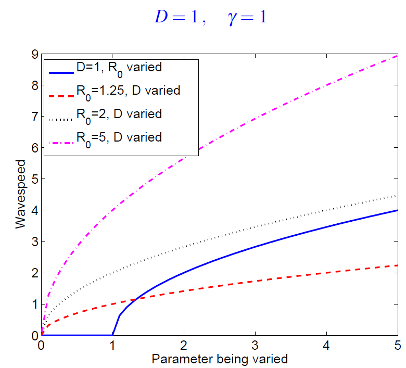</center>
> This Figure shows how the wavespeed formula can be directly solved to explore different combinations of model parameters on spatial spread speeds.

::: {.panel-tabset}

## Overview

The wavespeed result $c = 2\sqrt{D(R_0 - 1)\gamma}$ is derived by assuming a travelling wave solution exists and finding the minimum speed at which it can propagate. The technical note below walks through the key steps.

## Technical note: deriving the wavespeed

We work with the simplified reaction-diffusion SIR in one spatial dimension, assuming no demography and equal diffusion rates:

$$\frac{\partial S}{\partial t} = -\frac{\beta S I}{N} + D\frac{\partial^2 S}{\partial x^2}$$

$$\frac{\partial I}{\partial t} = \frac{\beta S I}{N} - \gamma I + D\frac{\partial^2 I}{\partial x^2}$$

**Step 1: The travelling wave ansatz**

We assume a solution of the form $z = x - ct$, where $c > 0$ is the wave speed. This means the wave profile moves to the right at constant speed without changing shape. Writing $S(x,t) = \hat{S}(z)$ and $I(x,t) = \hat{I}(z)$, the partial derivatives transform as per the chain rule:

$$\frac{\partial}{\partial t} = \frac{dz}{dt}\frac{d}{dz} = -c\frac{d}{dz}$$

$$\frac{\partial}{\partial x} = \frac{dz}{dx}\frac{d}{dz} = \frac{d}{dz}, \qquad \text{so} \qquad \frac{\partial^2}{\partial x^2} = \frac{d^2}{dz^2}$$
The system of equations then become ODEs

$$-c\frac{d\hat{S}}{dz} = -\frac{\beta \hat{S} \hat{I}}{N} + D\frac{d^2 \hat{S}}{dz^2}$$

$$-c\frac{d\hat{I}}{dz} = \frac{\beta \hat{S} \hat{I}}{N} - \gamma \hat{I} + D\frac{d^2\hat{I}}{dz^2}$$

**Step 2: Asymptotic behaviour ahead of the wave**

Far ahead of the wave front (large $z$), the population is almost entirely susceptible: $\hat{S} \approx N$ and $\hat{I} \approx 0$. Linearising the equation for $\hat{I}$ in this limit:

$$D\frac{d^2\hat{I}}{dz^2} + c\frac{d\hat{I}}{dz} + (\beta - \gamma)\hat{I} = 0$$

**Step 3: Exponential trial solution**

We try $\hat{I}(z) = e^{-\lambda z}$ with $\lambda > 0$ (so that $\hat{I} \to 0$ as $z \to \infty$, consistent with a wave front). Substituting:

$$(D\lambda^2 - c\lambda + (\beta - \gamma)) e^{-\lambda z} = 0$$
and since $e^{-\lambda z}\neq0$, then 
$$D\lambda^2 - c\lambda + (\beta - \gamma) = 0$$

Solving for $c$:

$$c = D\lambda + \frac{\beta - \gamma}{\lambda}  = \frac{D\lambda^2 + (\beta - \gamma)}{\lambda}$$

**Step 4: Minimum wavespeed**

For physically meaningful solutions we require $\lambda$ to be real, which requires the discriminant of the quadratic to be non-negative:

$$c^2 \geq 4D(\beta - \gamma)$$

The minimum wavespeed is therefore:

$$c_{\min} = 2\sqrt{D(\beta - \gamma)} = 2\sqrt{D(R_0 - 1)\gamma}$$

where we have used $R_0 = \beta/\gamma$ and so $\beta - \gamma = (R_0 - 1)\gamma$.

It can be shown that the wave selects this minimum speed when starting from localised initial conditions (a compact initial infected population), which is the biologically relevant case.

**Key takeaways**

- The result requires only that a travelling wave *exists*: the ansatz is the assumption, not a derivation from first principles.
- The minimum speed increases with $D$ (faster movement) and with $R_0 - 1$ (further above the epidemic threshold).
- When $R_0 \leq 1$, $\beta - \gamma \leq 0$ and no real $\lambda$ exists, consistent with no epidemic and no wave.

:::

**1.3 Let's reason through some specific scenarios using this formula. What happens if:**

**a) $\mathcal{R}_0 \leq 1$**

**b) As the value of $D$ increases, or the value of $\mathcal{R}_0$ increases?**

**c) How would halving $D$ vs $\mathcal{R}_0$ impact the wavespeed? **

```{=html}
<textarea cols="127" rows="4"></textarea>
```
<p><br></p>

**1.4 Using the wavespeed formula, what would you expect to happen to the speed of a dengue outbreak if the *Aedes* mosquito population became more dispersive (higher $D$)? What if an intervention reduced $\mathcal{R}_0$ from 3 to 1.5?**

```{=html}
<textarea cols="127" rows="4"></textarea>
```
<p><br></p>

**1.5 Reaction-diffusion models are rarely used to model modern human infectious diseases. Why do you think that is? What type of disease or host might they still be useful for?**

```{=html}
<textarea cols="127" rows="4"></textarea>
```
<p><br></p>

---

## A conceptual bridge: cellular automata

::: speaker-note
This section is intentionally brief. A two-minute signpost, not a deep dive. The purpose is to show participants that discretising a continuous-space model naturally leads toward the patch-based thinking of Part 2. If participants ask about the forest fire model in more detail, Keeling and Rohani Program 7.4 is a working Python implementation. A key thing to note if it comes up: cellular automata are almost always stochastic, and they are far more useful as conceptual tools than predictive ones for human disease. The mention of plant diseases (e.g. Panama fungus in banana plantations) is a deliberate nod to the fact that for closely packed, sessile (immobile) populations this approach can be genuinely appropriate.
:::

Before moving to metapopulation models, it is worth noting that when numerically solved, we are always discretising even "continuous" space (Left figure below). We can intentionally less finely discretise continuous space into a grid of cells (i.e. "A" in Figure 1, middle below). If we consider this now a grid of subpopulations, we tend to assume infection can only cross into adjacent grids (the neighbours). This is a specialist form of a metapopulation model with restricted travel assumptions. 

If we take the descritsation to the limit and assume each discretisaion holds only a single individual, we arrive at a **cellular automaton** model (right most figure below). Each cell has a state (susceptible, infected, recovered), and at each time step a susceptible cell can become infected if a neighbouring cell is infected. The classic example is the *forest fire model*, where fire (infection) spreads from burning (infected) trees to adjacent susceptible ones.

<center>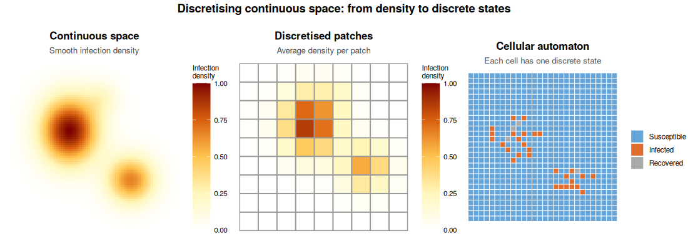</center>
>The three panels now tell a clear progression:
>
>Left: smooth continuous density using the same yellow-orange-red palette
>Middle: the same density field averaged into 8×8 coarse patches, with visible grid lines showing the discretisation --- this is the "metapopulation" step
>Right: fully discretised 28×28 cellular automaton where each cell has collapsed to a single S/I/R state

Cellular automata sit conceptually between reaction-diffusion models and metapopulation models: space is now discrete, but the "patches" are very small and interact only locally. They are most useful as conceptual tools for densely packed populations (plants in a field, animals in pens) rather than as predictive models for human disease. We will not study them in detail here, but they are worth knowing about.

> **Further reading on continuous-space models in practice:** For real-world applications of reaction-diffusion and advection-diffusion modelling to mosquito population dynamics, two closely related papers are worth reading together. Chan et al. (2016) develop a PDE-based spatial model for the spread of *Wolbachia* through *Aedes aegypti* populations: [https://arxiv.org/abs/1603.05744](https://arxiv.org/abs/1603.05744). 

Beeton et al. (2021) study mosquito populations at a continental scale to explore a mosquito replacement strategy: [https://doi.org/10.1371/journal.pcbi.1009526](https://doi.org/10.1371/journal.pcbi.1009526). The software implementation underlying Beeton et al. is *Mozzie*, an open-source spatiotemporal mosquito simulator: [https://doi.org/10.21105/joss.07324](https://doi.org/10.21105/joss.07324).

---

## R Practical 1: Visualising a travelling wave

::: speaker-note
Allow approximately 15--20 minutes for this practical. Participants should run the code as-is first (line by line, both to help them understand and otherwise as set up the plots won't appear) and spend a few minutes just describing what they see (question 1.6) before touching any parameters. This grounds them in the output before they start experimenting. The most common point of confusion is the indexing: `I_mat <- out[, (n+2):(2*n+1)]` extracts the infected counts because `out` has a time column as its first column, so the indexing is offset by 1. If anyone asks, walk through this briefly. For question 1.8, encourage participants to calculate the two wavespeeds by hand using the formula before checking against the plot: this is where the formula becomes real rather than abstract. The extension (1.9) is straightforward to implement and produces a satisfying symmetric double-wave result.
:::

We will solve the reaction-diffusion SIR model numerically in one spatial dimension. The trick is to discretise space into $n$ equally-spaced "cells" on a line, each with its own $S$, $I$, $R$ values. The diffusion term is approximated by comparing each cell to its immediate neighbours (a finite difference approximation).

**Run the code below first, then work through the questions underneath it. We recommend running the code line by line to get an understanding of what it is doing.**

```{r echo=TRUE, eval=TRUE, message=FALSE}
library(deSolve)
library(ggplot2)

# -------------------------------------------------------
# Reaction-diffusion SIR: discretised in 1D space
# -------------------------------------------------------

spatial_sir <- function(t, state, parms) {
  n     <- parms$n
  beta  <- parms$beta
  gamma <- parms$gamma
  D     <- parms$D

  S <- state[1:n]
  I <- state[(n + 1):(2 * n)]
  R <- state[(2 * n + 1):(3 * n)]
  N <- S + I + R

  # SIR dynamics at each location
  dS <- -beta * S * I / N
  dI <-  beta * S * I / N - gamma * I
  dR <-  gamma * I

  # Diffusion: finite difference Laplacian with reflecting boundaries
  laplacian <- function(x) {
    c(x[2] - x[1],
      x[3:n] - 2 * x[2:(n - 1)] + x[1:(n - 2)],
      x[n - 1] - x[n])
  }

  dS <- dS + D * laplacian(S)
  dI <- dI + D * laplacian(I)
  dR <- dR + D * laplacian(R)

  list(c(dS, dI, dR))
}

# -------------------------------------------------------
# Parameters and initial conditions
# -------------------------------------------------------
n     <- 100    # number of spatial cells
beta  <- 0.4    # transmission rate
gamma <- 0.1    # recovery rate
D     <- 0.5    # diffusion coefficient

# All cells start with 990 susceptibles and 0 infecteds,
# except cell 1 which has 10 infecteds to seed the outbreak.
S0 <- rep(990, n)
I0 <- rep(0,   n); I0[1] <- 10
R0 <- rep(0,   n)

state <- c(S0, I0, R0)
parms <- list(beta = beta, gamma = gamma, D = D, n = n)
times <- seq(0, 150, by = 1)

out <- ode(y = state, times = times, func = spatial_sir,
           parms = parms, method = "lsoda")

# -------------------------------------------------------
# Extract infected counts and plot snapshots over time
# -------------------------------------------------------
I_mat <- out[, (n + 2):(2 * n + 1)]  # I for each cell at each time

# Pick a few time snapshots to plot
snap_times <- c(1, 25, 50, 75, 100, 125, 150)
snap_idx   <- match(snap_times, times)

plot_df <- do.call(rbind, lapply(seq_along(snap_times), function(k) {
  data.frame(
    location = 1:n,
    infected = I_mat[snap_idx[k], ],
    time     = paste0("t = ", snap_times[k])
  )
}))
plot_df$time <- factor(plot_df$time,
                       levels = paste0("t = ", snap_times))

ggplot(plot_df, aes(x = location, y = infected, colour = time)) +
  geom_line(linewidth = 0.8) +
  labs(x = "Location (spatial cell)",
       y = "Number infected",
       colour = "Time",
       title = "Travelling wave of infection across space") +
  theme_bw()
```

**1.6 Describe in your own words what you see in the plot. In which direction does the wave travel? Does the shape of the wave change over time?**

```{=html}
<textarea cols="127" rows="4"></textarea>
```
<p><br></p>

**1.7 Now edit the code above to change the diffusion coefficient to <code>D <- 2.0</code>. Re-run it. How does the wave change? Does this match your expectation from the wavespeed formula?**

```{=html}
<textarea cols="127" rows="4"></textarea>
```
<p><br></p>

**1.8 Reset <code>D <- 0.5</code>. Now change <code>beta <- 0.6</code> (keeping <code>gamma <- 0.1</code>, so $\mathcal{R}_0$ increases from 4 to 6). Re-run. How does the wave change compared to the original? Is this consistent with the formula $c = 2\sqrt{D(\mathcal{R}_0 - 1)\gamma}$? (You can calculate approximate wavespeeds by noting roughly how many cells the front moves between two time snapshots.)**

```{=html}
<textarea cols="127" rows="4"></textarea>
```
<p><br></p>

**1.9 Extension (optional): Change the initial conditions so that infection starts in the *middle* of the spatial domain (cell 50) instead of at one end. What happens to the wave pattern?**

```{=html}
<textarea cols="127" rows="4"></textarea>
```
<p><br></p>

<p><input type="button" value="Print this page" onClick="window.print()"></p>

## **Part 1:** Solutions

::: {.panel-tabset}

## **Part 1:** Spoiler alert

The solutions tab contains suggested answers for Part 1. **Only click on it if you have tried to complete the exercises yourself and need some help.**

## **Part 1:** Solutions for Part 1

**1.1** There is no single correct answer here. Examples:

- Dengue in Thailand: space matters because Aedes aegypti density varies strongly between dense urban centres like Bangkok and rural provinces, and between islands and mainland. A non-spatial model cannot tell you whether an outbreak in Chiang Mai will reach the southern peninsula, or how fast.
- Influenza spreading across the ASEAN region: outbreaks seed from major aviation hubs (Bangkok, Singapore, Kuala Lumpur) and propagate outward. A non-spatial model cannot predict which countries are at risk first or the role of air travel connectivity.
- Avian influenza H5N1 along the East Asian-Australasian Flyway: spread is tied to migratory bird routes, making spatial structure fundamental to understanding transmission risk.

The key is identifying a question about *where* or *how fast* that a non-spatial model cannot address.

<p><br></p>

**1.2** The term $D\nabla^2 S$ represents the net movement of susceptible individuals into or out of a location due to random diffusion. If an area has more susceptibles than its neighbours, diffusion spreads them outward; if it has fewer, individuals flow in. If $D = 0$, there is no movement and every location runs its own independent SIR epidemic in isolation, so the epidemic would stay at the seed location and never spread spatially. If there is a large local population, this will look similar to the standard SIR model. If there's only a low density though, it will run through the population quickly.

<p><br></p>

**1.3** The formula helps us reason that:

a)   If $\mathcal{R}_0 \leq 1$, there is no wave (no epidemic).
b)  The wave travels faster if $D$ is larger (people move more) or $\mathcal{R}_0$ is larger (disease spreads more easily).
c)  Halving $\mathcal{R}_0$ (for example, through vaccination) has a bigger effect than halving $D$.

<p><br></p>

**1.4** If *Aedes* becomes more dispersive, $D$ increases and the wavespeed $c = 2\sqrt{D(\mathcal{R}_0-1)\gamma}$ increases --- the outbreak spreads geographically faster. If an intervention reduces $\mathcal{R}_0$ from 3 to 1.5, the wavespeed changes from $2\sqrt{D \times 2 \times \gamma}$ to $2\sqrt{D \times 0.5 \times \gamma}$. This is a reduction by a factor of $\sqrt{2/0.5} = 2$, i.e. the wave travels at half the original speed. Reducing $\mathcal{R}_0$ toward 1 can bring the wavespeed close to zero (no spatial spread).

<p><br></p>

**1.5** Reaction-diffusion models assume people move randomly and locally, like molecules in a fluid. Modern human transport is nothing like that: people fly across continents, skip past intermediate locations entirely, and move purposefully rather than randomly. Additionally, there are changes in the susceptible population from things like vaccination, impacting how those "molecules" interact. These long-range, non-local movement events are not captured by diffusion. For animal diseases (foot-and-mouth in livestock, rabies in foxes) or plant diseases (wind-dispersed fungal spores, vector insects dispersing locally), or movement of vectors, local diffusive spread remains a much more appropriate model.

<p><br></p>

**1.6** The wave travels from left to right (from the seed at cell 1 toward cell 100). The shape is roughly stable, with a steep rising front followed by a long tail of recovery, but the peak height drops slightly as the wave propagates because the total number of individuals in each cell is fixed and the wave is spreading across more cells. This is most obvious for the first and last time printed. The front moves at roughly constant speed, just like our maths predicted!

<p><br></p>

**1.7** With <code>D <- 2.0</code>, the wavespeed is higher: the front reaches the far end of the domain more quickly. The peak of the wave is also lower and broader, because faster movement spreads infecteds across more spatial cells simultaneously. This is consistent with $c \propto \sqrt{D}$: increasing $D$ from 0.5 to 2.0 (a factor of 4) should approximately double the wavespeed.

<p><br></p>

**1.8** With <code>beta <- 0.6</code> and <code>gamma <- 0.1</code>, $\mathcal{R}_0 = 6$. The original $\mathcal{R}_0 = \beta/\gamma = 0.4/0.1 = 4$. Wavespeeds:

- Original: $c = 2\sqrt{0.5 \times (4-1) \times 0.1} = 2\sqrt{0.15} \approx 0.77$
- New: $c = 2\sqrt{0.5 \times (6-1) \times 0.1} = 2\sqrt{0.25} = 1.0$

So the wave should be roughly 30% faster. The wave also produces a higher peak infection count (more people are infected at any one time because transmission is faster).

<p><br></p>

**1.9** With infection seeded in the middle, the local number first drastically increases, then two waves travel outward in opposite directions simultaneously: one toward cell 1 and one toward cell 100. The waves are symmetric and travel at the same speed. The epidemic ends sooner because both halves of the domain are reached at roughly the same time.

This is achieved by changing line 49 (of the original code):
`I0 <- rep(0, n); I0[50] <- 10`

<p><br></p>

:::

---

# **Part 2:** Metapopulation models

## From continuous to patchy space

::: speaker-note
This transition paragraph is important for cohesion. Participants should understand that metapopulation models are not a completely different beast, they are what you get when you replace the continuously diffusing landscape with a set of discrete locations connected by purposeful travel. The key framing shift is from "individuals diffuse randomly" to "individuals travel between specific places and return home." A useful prompt: ask participants to think about their own weekly movements. Most people have a home base and visit a small number of other locations regularly, which is exactly the commuter structure the model captures.

**Real-world case study to draw on:** A concrete two-paper arc illustrating the metapopulation approach is available and worth knowing. [Hickson, Mercer & Lokuge (2011)](https://doi.org/10.36334/modsim.2011.B2.hickson){target="_blank"} built a single-population TB model for Papua New Guinea (PNG), fitted to WHO data on incidence, prevalence, and mortality. At the end of that paper they noted the obvious next step: a metapopulation extension to capture cross-border TB transmission between PNG and the Torres Strait Islands (TSIs). Hickson, Mercer & Lokuge (2012) then built exactly that model, published in *PLoS ONE* (open access): [https://doi.org/10.1371/journal.pone.0034411](https://doi.org/10.1371/journal.pone.0034411){target="_blank"}. The two-patch setup is PNG (high burden, patch 1) and the Australian Torres Strait Islandss (low burden, patch 2), connected by documented cross-border movement. The movement data underpinning the coupling parameters comes directly from treaty-based border crossing records: 59,003 movements in 2008--09, 98% by PNG nationals, with an average stay of approximately one day. This gives an extremely small $q$ value, placing the model firmly in the weak-coupling regime students will explore in the practical. Despite this, the sensitivity analysis found that all six dominant parameters belong to PNG: a clean illustration that even weak coupling from a high-burden source dominates the receiving population's dynamics.
:::


The reaction-diffusion framework assumes populations are spread smoothly across a continuous landscape and move randomly. Neither of these is a good description of human populations: we live in cities, towns, and villages, and we travel purposefully between them.

A **metapopulation model** divides the population into discrete **patches** (also called subpopulations, regions, or nodes): think towns, suburbs, or countries. "Metapopulation" literally means "a population of populations". Unlike the conceptual bridge note above, these do not need to be spatially contiguous. Within each patch the well-mixed assumption is applied. Patches are then coupled by movement between them. 

There are several ways to structure the connections between patches, and the
choice matters for the dynamics:

- **Island (hub) model:** all patches connect equally to a central hub, with
  symmetric flows. A **source-sink** variant arises when flows are strongly
  asymmetric --- as in the PNG--Torres Strait Islands TB example, where 98%
  of movements were PNG nationals travelling into the Torres Strait, making
  PNG a persistent source. This is captured naturally in the commuter framework
  by setting asymmetric $\ell_{ij}$ values rather than requiring a separate
  model structure.
- **Stepping-stone model:** patches only connect to their immediate neighbours.
  The grid version below is exactly the coarse patch grid from Part 1 --- the
  same spatial structure, just with each cell now treated as a distinct
  subpopulation. The ring version shows the same connectivity principle
  abstracted into the node-and-edge notation used in network diagrams.
- **Commuter model:** patches are fully (or partially) connected by realistic
  human mobility flows, with individuals leaving their home patch, spending
  time elsewhere, and returning. Movement rates can be estimated from census
  data, mobile phone records, or airline passenger data. Line thickness in the
  figure below represents flow strength. This is the framework we will use in
  this session.

<center>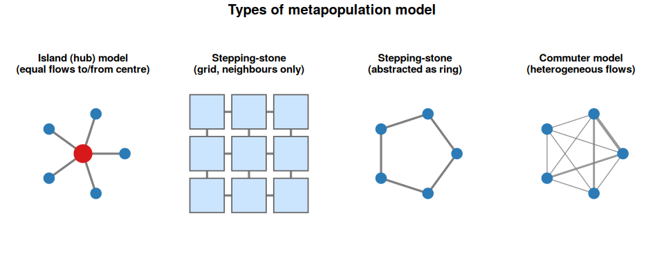</center>

<p><br></p>

This structure is one of the most practically useful spatial approaches for
infectious disease in humans. It maps naturally onto the way population data
is collected (by administrative region), is relatively straightforward to
implement, and can capture the effects of human mobility patterns in a
principled way.

---

## The commuter framework

::: speaker-note
The double-subscript notation ($S_{ij}$) is the most common point of confusion in this section. Spend time on it before moving to the equations. The schematic figure below is your main tool here --- point to each box and arrow while saying out loud what it represents. A good check: ask a participant to say in plain English what $S_{21}$ means (residents of patch 2, currently visiting patch 1, who are susceptible). Once that clicks, the equations make much more sense. Also worth noting: the force of infection term $\sum_j I_{ij} / N_i$ sums over everyone currently in patch $i$, regardless of where they live. This is the key biological assumption that you can only catch the disease where you physically are.

**Connecting the TB case study to familiar model structures:** The Hickson et al. (2012) model uses six compartments per subpopulation: S, L, I, P, D, T. If a participant asks how this relates to model structures they already know, the following conceptual mapping is useful: S maps directly to S (susceptible); L maps to E (exposed/latent, not yet infectious); I, D, and T all map together to I (infectious: D are detected but still infectious, T are under treatment but still infectious during the early treatment period); and P maps to A (asymptomatic or non-infectious active disease, analogous to the A compartment in SEIAR models). There is no R compartment, as individuals leave I, D, T, or P and become susceptible to infection again. A good discussion question for participants is: *why were the extra compartments needed beyond a simple SEIAR?* The answer lies in the intervention structure: splitting I into I, D, and T allows the model to explicitly track DOTS program coverage and treatment delays, which is precisely what the paper is trying to evaluate. Without those compartments, you cannot ask the policy-relevant question of what happens when detection rates increase. In particular, these were used in the subsequent economic analyses in later papers.

**Note on the code structure:** The R implementation in the practical makes the $3n^2$ compartment structure from question 2.2 concrete: for two patches there are 12 named state variables, grouped as all S variables first ($S11$, $S12$, $S21$, $S22$), then all $I$ variables, then all $R$ variables. The departure and return rates $l$ and $r$ in the code map directly to $\ell_{ij}$ and $r_{ij}$ in the equations above. This is a clean illustration of why the $3n^2$ compartment count is not just a theoretical curiosity, it is what the code actually allocates.
:::

Permanent migration between cities is (usually) epidemiologically much less important than the daily or weekly movement of **commuters**: people who visit other patches and then return home. The metapopulation model for humans therefore tracks not just where people are, but where they *live*.

Let $S_{ij}$ be the number of susceptibles who **live in patch $j$** but are **currently visiting patch $i$**. Similarly define $I_{ij}$ and $N_{ij}$. The diagonal entries, $S_{ii}$, are the locals currently at home.

The figure below illustrates this for two patches and two regions. Each box is a subpopulation defined by both home patch and current location. The arrows show the leaving rate $\ell$ (orange) and return rate $r$ (purple).

<center>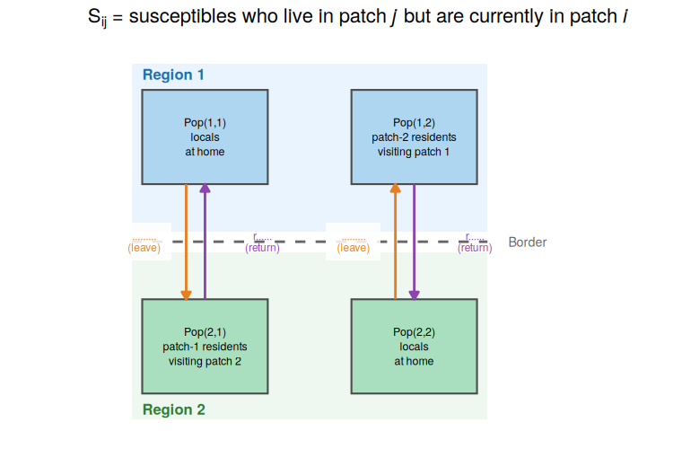</center>

<p><br></p>

Two key parameters describe movement:

-   $\ell_{ij}$: the rate at which residents of patch $j$ *leave* to visit patch $i$
-   $r_{ij}$: the rate at which visitors from patch $j$ *return home* from patch $i$

The equations for residents of patch $j$ currently at home (the $ii$ subscript) and those currently visiting patch $i$ (the $ij$ subscript) are:

$$\frac{dS_{ii}}{dt} = - \underbrace{\text{locals infected at home}}_{\text{infection}} - \underbrace{\text{locals who leave to visit another patch}}_{\text{departure}} + \underbrace{\text{locals returning from visiting another patch}}_{\text{return}} $$

$$\frac{dS_{ii}}{dt} = -\underbrace{\beta_i S_{ii} \frac{\sum_j I_{ij}}{N_i}}_{\text{infection}} - \underbrace{\sum_j \ell_{ji} S_{ii}}_{\text{departure}} + \underbrace{\sum_j r_{ji} S_{ji}}_{\text{return}}$$
$$\frac{dS_{ij}}{dt} = - \underbrace{\text{those from patch } j \text{ infected in patch } i}_{\text{infection}} + \underbrace{\text{those from patch } j \text{ visiting patch } i}_{\text{arrival}} - \underbrace{\text{those who return home}}_{\text{return}} $$

$$\frac{dS_{ij}}{dt} = -\underbrace{\beta_i S_{ij} \frac{\sum_j I_{ij}}{N_i}}_{\text{infection}} + \underbrace{\ell_{ij} S_{jj}}_{\text{arrival}} - \underbrace{r_{ij} S_{ij}}_{\text{return}}$$

where $N_i = \sum_j N_{ij}$ is the *total current population* of patch $i$ (residents plus visitors).

Similarly, for those infectious residents at home ($I_{ii}$):

$$\frac{dI_{ii}}{dt} = \text{locals who become infectious at home} + \text{infectious locals returning from visiting another patch} - \text{infectious locals who leave to visit another patch} - \text{infectious locals who recover} $$
$$\frac{dI_{ii}}{dt} = \beta_i S_{ii} \frac{\sum_j I_{ij}}{N_i} - \gamma_{ii} I_{ii} - \sum_j \ell_{ji} I_{ii} + \sum_j r_{ji} I_{ji} $$

and for infectious visitors ($I_{ij}$, $i \neq j$):

$$\frac{dI_{ij}}{dt} = \text{those from patch } j \text{ who become infectious in patch } i + \text{infectious arrivals from patch } j - \text{infectious visitors who return home} - \text{infectious visitors who recover} $$

$$\frac{dI_{ij}}{dt} = \beta_i S_{ij} \frac{\sum_j I_{ij}}{N_i} - \gamma_{ij} I_{ij} + \ell_{ij} I_{jj} - r_{ij} I_{ij}$$

Notice that the force of infection uses $N_i$ in the denominator: you can only be infected where you currently are, mixing with whoever else happens to be in that patch at the same time.

**2.1 Why do the for residents at home equations have sums over those leaving and returning when the equations for those visiting do not?**

```{=html}
<textarea cols="127" rows="4"></textarea>
```
<p><br></p>

**2.2 For a metapopulation model with $n$ patches and an SIR disease model, how many state variables (compartments) are there in total? For $n = 10$, how many is that?**

```{=html}
<textarea cols="127" rows="4"></textarea>
```
<p><br></p>

<!-- todo: time permitting, we should ask them to write down the R equations. Alternatively, we may need to add them in above these questions.-->

---

## Coupling strength and synchrony

::: speaker-note
The synchrony result is one of the most practically important and counter-intuitive results in spatial infectious disease modelling, and it is worth dwelling on it. The key point to drive home: you do not need strong coupling to synchronise outbreaks. Even $q \approx 0.01$ (1% of time spent away) can be sufficient to drag the epidemic timing in two patches together if sustained over months. This has direct implications for border closure policies: by the time a government considers closing borders, the coupling has almost always already been sufficient to seed the epidemic in the receiving patch. The figure below is pre-computed to save time --- refer to it here, then let participants reproduce and extend it in the practical.
:::

A useful summary of movement is the **proportion of time** an individual from patch $j$ spends in patch $i$, 

$$q = \frac{\ell_{ij}}{r_{ji} + \ell_{ij}} $$

When $q = 0$, there is no movement and the patches are independent. When $q = 0.5$, individuals spend equal time in both patches. It can be shown that the transfer of infection between patches is maximised at $q = 0.5$.

A key qualitative result is that as coupling strength increases, the dynamics of two patches transition from **independent** (each with its own epidemic curve, perhaps at different times) to **synchronised** (peaks coincide). This transition happens over a wide range of coupling values, roughly from $q \approx 10^{-4}$ to $q \approx 0.1$. The figure below illustrates this directly.

<center>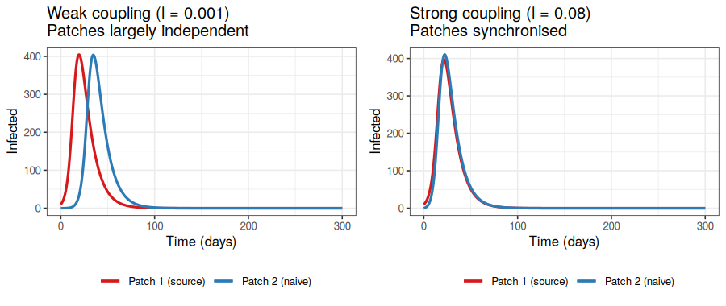</center>

<p><br></p>

This has direct public health implications: even fairly weak coupling between regions can synchronise outbreaks across an entire country, making local interventions (such as border closures or targeted vaccination) less effective than they might otherwise be, and showing the importance of movement restrictions strictness or potential boarder leakiness.

**2.3 Suppose a disease is spreading independently in two distant cities. A new direct flight route opens between them. How might this change the dynamics of the outbreak? What would a modeller need to quantify to answer this properly?**

```{=html}
<textarea cols="127" rows="4"></textarea>
```
<p><br></p>

::: {.panel-tabset}

## Overview

The proportion of time $q$ an individual spends in the visited patch can be
derived directly from the leaving and return rates in the model.

## Technical note: deriving $q$

Consider a single individual who lives in patch $j$ and makes repeated visits
to patch $i$. They alternate between two states:

- **At home** in patch $j$, leaving to visit patch $i$ at rate $\ell_{ij}$
- **Visiting** patch $i$, returning home at rate $r_{ij}$

At equilibrium, the rate of flow out of each state must equal the rate of flow
into it. Let $p_{\text{home}}$ and $p_{\text{away}} = 1 - p_{\text{home}}$ be
the long-run proportions of time spent at home and away respectively. Balancing
flows:

$$\ell_{ij} \, p_{\text{home}} = r_{ij} \, p_{\text{away}}$$

That is, the rate of leaving (from home) equals the rate of returning (from
away). Substituting $p_{\text{away}} = 1 - p_{\text{home}}$ and solving:

$$\ell_{ij} \, p_{\text{home}} = r_{ij}(1 - p_{\text{home}})$$

$$p_{\text{home}}(\ell_{ij} + r_{ij}) = r_{ij}$$

$$p_{\text{home}} = \frac{r_{ij}}{r_{ij} + \ell_{ij}}$$

The proportion of time spent *away* is therefore:

$$q = 1 - p_{\text{home}} = \frac{\ell_{ij}}{r_{ij} + \ell_{ij}}$$

This is a simple two-state continuous-time Markov chain result. Note that $q$
depends only on the *ratio* of the leaving and return rates, not their absolute
values. Doubling both rates halves the average duration of each stay and each
home period, but leaves $q$ unchanged, the individual still splits their
time in the same proportions. What changes with faster rates is how quickly
the population mixes between patches.

:::

---

## Human mobility models: how do we parameterise movement?

::: speaker-note
This section can be kept fairly brief, say 5 to 10 minutes, as the goal is awareness rather than technical depth. The gravity model is worth naming because participants will encounter it in the literature constantly. The radiation model is worth noting because it is the standard "I have no calibration data" alternative; it appeared prominently in work on Ebola spread in West Africa precisely because reliable mobility data was unavailable. The most important practical message is the last paragraph: mobile phone data has transformed this field, and participants should know it exists and know about the privacy and access trade-offs. For a concrete data source, the Google COVID-19 Community Mobility Reports [https://www.google.com/covid19/mobility/](https://www.google.com/covid19/mobility/) are a well-known example of what is now possible, with all the caveats around representativeness.
:::

A metapopulation model requires estimates of $\ell_{ij}$ and $r_{ij}$ between every pair of patches. For $n$ patches, that is up to $n(n-1)$ parameter pairs. Two mathematical models are commonly used to estimate mobility flows from available data, the "gravity model" or "radiation model".

**Gravity model**

Inspired by Newton's law of gravitation, the gravity model assumes that the flow of people between location $i$ and location $j$ is proportional to their populations and decreases with distance:

$$F_{ij} = k \frac{N_i^\alpha N_j^\alpha}{d_{ij}^\rho}$$

where $N_i$ and $N_j$ are populations, $d_{ij}$ is the distance between them, and $k$, $\alpha$, $\rho$ are parameters fitted to data (e.g. census commuting surveys, mobile phone call records).

**Radiation model**

The radiation model is a more recent, parameter-free alternative. It predicts mobility flows based on population density alone, without needing calibration data. The key idea is that a person travels to the nearest location that offers a better "opportunity" than those available locally. This makes it attractive for settings where commuting data is scarce. See Simini et al. (2012) for the original derivation: [https://doi.org/10.1038/nature10856](https://doi.org/10.1038/nature10856).

Both models have limitations: the gravity model needs fitting data and its parameters vary by region; the radiation model tends to underestimate long-distance travel. In practice, mobile phone data and GPS traces are increasingly used to directly estimate mobility matrices, though data access and privacy issues remain significant.

**2.4 Why might a gravity model be unreliable for modelling disease spread during an ongoing epidemic? (Hint: think about how human behaviour might change.)**

```{=html}
<textarea cols="127" rows="4"></textarea>
```
<p><br></p>

---

## R Practical 2: A two-patch SIR model

::: speaker-note
Allow approximately 20 minutes for this practical. The most important questions are 2.5 (understanding the output), 2.6 (connecting the formula for $q$ to the parameters), and 2.7 (observing synchronisation). Question 2.8 (very weak coupling) is useful for grounding the model: participants should see that the result approaches two independent epidemics. Question 2.9 (border closure) is the richest discussion question and can be used as a whole-group debrief if time allows. A common source of confusion: the model tracks 12 state variables, but the plot only shows the total infecteds in each patch (summing residents and visitors). If participants ask "why are there 12 variables for two patches?", refer back to the $3n^2$ formula from question 2.2. If participants struggle with the code structure, point them to the comments: each block of three lines handles one subpopulation.
:::

> **Case study:** The practical below uses TB as a simple illustration, as the same two-patch commuter structure has been applied to real cross-border TB transmission between Papua New Guinea and the Australian Torres Strait Islands. In that setting, patch 1 is the high-burden PNG South Fly district and patch 2 is the low-burden Australian Torres Strait Islands, connected by treaty-based border movement. The model used six disease compartments per subpopulation rather than three, but the spatial structure, and the notation, is identical to what you are about to implement. See Hickson, Mercer & Lokuge (2012), *PLoS ONE*: [https://doi.org/10.1371/journal.pone.0034411](https://doi.org/10.1371/journal.pone.0034411).

We will build a two-patch SIR model for TB, motivated by the PNG--Torres Strait Islands case study. TB spreads directly between people, making it a natural fit for a human movement metapopulation model: infection is carried between patches by infectious individuals travelling and returning home.

We have two patches: a high-burden community (patch 1) with TB already established, and a low-burden community (patch 2) that is initially TB-free. Humans commute between them.

We track 12 state variables in total:

- Residents of patch 1 at home: $S_{11}$, $I_{11}$, $R_{11}$
- Residents of patch 1 visiting patch 2: $S_{12}$, $I_{12}$, $R_{12}$
- Residents of patch 2 at home: $S_{22}$, $I_{22}$, $R_{22}$
- Residents of patch 2 visiting patch 1: $S_{21}$, $I_{21}$, $R_{21}$

**Read through the code below and make sure you understand the structure before running it, then run it line by line.**

```{r echo=TRUE, eval=TRUE, message=FALSE}
# -------------------------------------------------------
# Two-patch SIR: commuter framework
# -------------------------------------------------------
library(deSolve)
library(ggplot2)

# -------------------------------------------------------
# Two-patch SIR: commuter framework
# Subscript convention: S_{ij} = susceptibles from patch j
# currently in patch i. First subscript = current location,
# second subscript = home patch.
# -------------------------------------------------------
two_patch_sir <- function(t, state, parms) {
  with(as.list(c(state, parms)), {

    N1 <- S11 + I11 + R11 + S12 + I12 + R12
    N2 <- S22 + I22 + R22 + S21 + I21 + R21

    Itot1 <- I11 + I12
    Itot2 <- I22 + I21

    lambda1 <- beta * Itot1 / N1
    lambda2 <- beta * Itot2 / N2

    # --- Patch-1 residents at home (S_{11}) ---
    # Leave to visit patch 2 at rate l_21; return from patch 2 at rate r_21
    dS11 <- -lambda1 * S11 - l_21 * S11 + r_21 * S21
    dI11 <-  lambda1 * S11 - gamma * I11 - l_21 * I11 + r_21 * I21
    dR11 <-  gamma * I11   - l_21 * R11 + r_21 * R21

    # --- Patch-2 residents visiting patch 1 (S_{12}) ---
    # Arrive from patch 2 at rate l_12; return home at rate r_12
    dS12 <- -lambda1 * S12 + l_12 * S22 - r_12 * S12
    dI12 <-  lambda1 * S12 - gamma * I12 + l_12 * I22 - r_12 * I12
    dR12 <-  gamma * I12   + l_12 * R22 - r_12 * R12

    # --- Patch-2 residents at home (S_{22}) ---
    # Leave to visit patch 1 at rate l_12; return from patch 1 at rate r_12
    dS22 <- -lambda2 * S22 - l_12 * S22 + r_12 * S12
    dI22 <-  lambda2 * S22 - gamma * I22 - l_12 * I22 + r_12 * I12
    dR22 <-  gamma * I22   - l_12 * R22 + r_12 * R12

    # --- Patch-1 residents visiting patch 2 (S_{21}) ---
    # Arrive from patch 1 at rate l_21; return home at rate r_21
    dS21 <- -lambda2 * S21 + l_21 * S11 - r_21 * S21
    dI21 <-  lambda2 * S21 - gamma * I21 + l_21 * I11 - r_21 * I21
    dR21 <-  gamma * I21   + l_21 * R11 - r_21 * R21

    list(c(dS11, dI11, dR11,
           dS12, dI12, dR12,
           dS22, dI22, dR22,
           dS21, dI21, dR21))
  })
}

# -------------------------------------------------------
# Parameters
# -------------------------------------------------------
parms <- c(
  beta   = 0.4,   # transmission rate (per day)
  gamma  = 0.1,   # recovery rate (per day, so mean duration = 10 days)
  l_12   = 0.01,  # rate patch-2 residents leave to visit patch 1 (per day)
  l_21   = 0.01,  # rate patch-1 residents leave to visit patch 2 (per day)
  r_12   = 0.5,   # rate patch-2 visitors return home from patch 1 (per day)
  r_21   = 0.5    # rate patch-1 visitors return home from patch 2 (per day)
)

# -------------------------------------------------------
# Initial conditions
# -------------------------------------------------------
# Patch 1: high-burden community, TB established (10 infectious)
# Patch 2: low-burden community, initially TB-free
# No one is visiting at t = 0
state <- c(
  S11 = 990,  I11 = 10, R11 = 0,   # patch-1 residents at home
  S12 = 0,    I12 = 0,  R12 = 0,   # patch-2 residents visiting patch 1
  S22 = 1000, I22 = 0,  R22 = 0,   # patch-2 residents at home
  S21 = 0,    I21 = 0,  R21 = 0    # patch-1 residents visiting patch 2
)

times <- seq(0, 300, by = 0.5)
out   <- ode(y = state, times = times, func = two_patch_sir,
             parms = parms)
out   <- as.data.frame(out)

# -------------------------------------------------------
# Total infecteds in each patch (residents + visitors)
# -------------------------------------------------------
out$I_patch1 <- out$I11 + out$I12
out$I_patch2 <- out$I22 + out$I21

ggplot(out, aes(x = time)) +
  geom_line(aes(y = I_patch1, colour = "Patch 1 (high burden)"), linewidth = 0.9) +
  geom_line(aes(y = I_patch2, colour = "Patch 2 (low burden)"),  linewidth = 0.9) +
  labs(x = "Time (days)", y = "Number infected",
       colour = "Patch",
       title = "Two-patch TB model: infectious individuals in each patch") +
  theme_bw()
 
```

**2.5 Describe the epidemic in both patches. Does the outbreak in patch 2 look the same as in patch 1? What is the approximate time delay between the two peaks?**

```{=html}
<textarea cols="127" rows="4"></textarea>
```
<p><br></p>

**2.6 The current leaving rates are <code>l_21 <- 0.01</code> and <code>l_12 <- 0.01</code> (1% of residents leave per day in each direction) and both return rates are <code>r_21 <- r_12 <- 0.5</code>. Using the formula $q = \ell / (r + \ell)$, calculate the proportion of time a resident from each patch spends away from their home patch. Are the two patches symmetrically coupled? Would you describe this as strong or weak coupling?**

```{=html}
<textarea cols="127" rows="4"></textarea>
```
<p><br></p>

**2.7 Change the leaving rate to <code>l <- 0.05</code> (5% per day, stronger coupling) and re-run. How does the time delay between the two epidemics change? What happens to the peak sizes?**

```{=html}
<textarea cols="127" rows="4"></textarea>
```
<p><br></p>

**2.8 Now try <code>l <- 0.0001</code> (very weak coupling). Describe what you see. How does this compare to running two completely independent SIR models?**

```{=html}
<textarea cols="127" rows="4"></textarea>
```
<p><br></p>

**2.9 The default parameters assume equal movement rates in both directions. In reality, movement between two communities is often strongly asymmetric. Using the TB PNG--Torres Strait Islands case study as motivation, set `l_21 <- 0.057` (patch-1 residents leaving to patch 2, representing high outward movement from the high-burden patch) and `l_12 <- 0.007` (patch-2 residents leaving to patch 1, representing low movement in the other direction), keeping both return rates at `r_21 <- r_12 <- 0.5`. Calculate $q$ for each direction. How do the epidemic dynamics in patch 2 change compared to the symmetric case? What does this suggest about the importance of correctly capturing movement asymmetry?**

```{=html}
<textarea cols="127" rows="4"></textarea>
```
<p><br></p>

**2.10 Extension (optional): Suppose a public health authority closes the link between the two cities at day 30 (i.e. sets <code>l <- 0</code> after day 30). You would need to run the model in two stages: first from $t = 0$ to $t = 30$, then take those end states as new initial conditions and run from $t = 30$ to $t = 300$ with <code>l <- 0</code>. Does this prevent the outbreak in patch 2? Does the timing of closure matter?**

```{=html}
<textarea cols="127" rows="4"></textarea>
```
<p><br></p>

::: {.panel-tabset}

## Overview

The practical above implements a two-patch model with explicitly named state variables. The technical note below shows how the same model can be written in a generalised form for $n$ patches, which scales to any number of regions without rewriting the equations.

## Technical note: n-patch generalisation

For $n$ patches the state variables are stored as matrices of dimension $n \times n$, where entry $(i, j)$ corresponds to individuals from patch $j$ currently in patch $i$. This matches the mathematical notation exactly.

```{r echo=TRUE, eval=FALSE}
library(deSolve)
library(ggplot2)

# -------------------------------------------------------
# n-patch SIR: generalised commuter framework
#
# State matrices S, I, R are n x n where entry (i,j)
# represents individuals from patch j currently in patch i.
# l and r are n x n matrices of leaving and return rates,
# with diagonal entries set to zero (no self-travel).
# -------------------------------------------------------
n_patch_sir <- function(t, state, parms) {
  n     <- parms$n
  beta  <- parms$beta
  gamma <- parms$gamma
  l     <- parms$l      # n x n leaving rate matrix
  r     <- parms$r      # n x n return rate matrix

  # Recover n x n matrices from state vector
  S <- matrix(state[1:n^2],           n, n)
  I <- matrix(state[(n^2+1):(2*n^2)], n, n)
  R <- matrix(state[(2*n^2+1):(3*n^2)], n, n)

  # Total population currently in each patch (row sums)
  N_patch <- rowSums(S + I + R)

  # Total infecteds currently in each patch (row sums)
  I_patch <- rowSums(I)

  # Force of infection in each patch
  lambda <- beta * I_patch / N_patch  # length-n vector

  # Initialise derivative matrices
  dS <- matrix(0, n, n)
  dI <- matrix(0, n, n)
  dR <- matrix(0, n, n)

  for (i in 1:n) {
    for (j in 1:n) {
      # Local transmission (infection occurs at current location i)
      dS[i,j] <- -lambda[i] * S[i,j]
      dI[i,j] <-  lambda[i] * S[i,j] - gamma * I[i,j]
      dR[i,j] <-  gamma * I[i,j]

      # Movement: individuals leave home patch j to visit other patches
      # and return from visited patches back to home patch j
      if (i == j) {
        # Diagonal: residents at home
        # Lose those who leave to any other patch k
        dS[i,j] <- dS[i,j] - sum(l[,j]) * S[i,j] + sum(r[i,] * S[,j])
        dI[i,j] <- dI[i,j] - sum(l[,j]) * I[i,j] + sum(r[i,] * I[,j])
        dR[i,j] <- dR[i,j] - sum(l[,j]) * R[i,j] + sum(r[i,] * R[,j])
      } else {
        # Off-diagonal: visitors from patch j currently in patch i
        # Gain from patch-j residents leaving home to visit patch i
        # Lose those returning home to patch j
        dS[i,j] <- dS[i,j] + l[i,j] * S[j,j] - r[i,j] * S[i,j]
        dI[i,j] <- dI[i,j] + l[i,j] * I[j,j] - r[i,j] * I[i,j]
        dR[i,j] <- dR[i,j] + l[i,j] * R[j,j] - r[i,j] * R[i,j]
      }
    }
  }

  list(c(dS, dI, dR))
}

# -------------------------------------------------------
# Example: 3-patch model
# -------------------------------------------------------
n <- 3

# Leaving rates: l[i,j] = rate patch-j residents leave to visit patch i
# Diagonal must be zero (cannot leave to your own patch)
l <- matrix(c(0,    0.01, 0.005,
              0.01, 0,    0.01,
              0.005,0.01, 0), nrow = n, byrow = TRUE)

# Return rates: r[i,j] = rate patch-j visitors return home from patch i
r <- matrix(c(0,   0.5, 0.5,
              0.5, 0,   0.5,
              0.5, 0.5, 0), nrow = n, byrow = TRUE)

parms <- list(n = n, beta = 0.4, gamma = 0.1, l = l, r = r)

# Initial conditions: infection seeded in patch 1 only
# S, I, R matrices stored column by column
S0 <- matrix(c(990, 0, 0,
               0, 1000, 0,
               0, 0, 1000), nrow = n)
I0 <- matrix(c(10, 0, 0,
               0, 0, 0,
               0, 0, 0), nrow = n)
R0 <- matrix(0, n, n)

state0 <- c(S0, I0, R0)
times  <- seq(0, 300, by = 0.5)

out <- ode(y = state0, times = times, func = n_patch_sir,
           parms = parms)
out <- as.data.frame(out)

# -------------------------------------------------------
# Extract total infecteds in each patch (residents + visitors)
# I matrix columns are stored in positions (n^2+1):(2*n^2)
# Row i of I matrix = all individuals currently in patch i
# -------------------------------------------------------
I_cols <- (n^2 + 2):(2*n^2 + 1)  # +1 offset for time column
I_mat  <- out[, I_cols]

# Total infected in each patch = row sums of I matrix at each time
# Columns of out correspond to I[1,1], I[2,1], I[3,1], I[1,2], ...
for (i in 1:n) {
  patch_cols    <- seq(i, n^2, by = n)  # row i of the n x n matrix
  out[[paste0("I_patch", i)]] <- rowSums(I_mat[, patch_cols])
}

ggplot(out, aes(x = time)) +
  geom_line(aes(y = I_patch1, colour = "Patch 1"), linewidth = 0.9) +
  geom_line(aes(y = I_patch2, colour = "Patch 2"), linewidth = 0.9) +
  geom_line(aes(y = I_patch3, colour = "Patch 3"), linewidth = 0.9) +
  labs(x = "Time (days)", y = "Number infected",
       colour = "Patch",
       title = "Three-patch TB model: infectious individuals per patch") +
  theme_bw()
```

:::

<p><input type="button" value="Print this page" onClick="window.print()"></p>

## **Part 2:** Solutions

::: {.panel-tabset}

## **Part 2:** Spoiler alert

The solutions tab contains suggested answers for Part 2. **Only click on it if you have tried to complete the exercises yourself and need some help.**

## **Part 2:** Solutions for Part 2

**2.1** The term $\ell_{ji} S_{ii}$ represents the rate at which susceptible *locals* (residents of patch $i$ currently at home) leave to visit patch $j$, as an outflow from the home compartment. Similarly the term $r_{ji} S_{ji}$ represents the rate at which susceptible residents of patch $i$ who are currently *visiting* patch $j$ return home, an inflow to the home compartment. Since they could leave to any patch $j$ or come home from any other patch, we must sum over the other patches. However, for visits, since the commuter model assumes people must return to their home patch first, we only have to track those coming in or back to that home patch. If it were a more connect network of patches, there would also be sums.

<p><br></p>

**2.2** For each pair of patches $(i, j)$ (including $i = j$ for residents at home) and each disease compartment (S, I, R), there is one state variable. The number of pairs is $n^2$ (since we need both "resident of $j$ visiting $i$" and "resident of $i$ at home"), giving $3n^2$ state variables in total. For $n = 10$: $3 \times 100 = 300$ state variables. 

In general, the number of compartments = (Number of regions)$^2 \times $ Number of compartments in the disease model (3 for SIR). This rapid growth with $n$ is the "parameter explosion" problem of metapopulation models.

<p><br></p>

**2.3** The new flight route introduces a new mobility pathway: it increases $\ell_{ij}$ and $\ell_{ji}$ between the two cities. Depending on the flight frequency and the volume of travellers, this could synchronise the outbreaks (making them peak at the same time) and reduce the effective delay before the disease arrives in the second city. To quantify this properly, you would need: the number of daily passengers, the pre-flight commuting rate (if any), and the current disease prevalence in each city. A metapopulation model with a gravity or data-derived mobility matrix would then let you estimate the effect.

<p><br></p>

**2.4** The gravity model (and most mobility models) are calibrated to normal human movement patterns. During an epidemic, people change their behaviour: they may travel less, avoid infected areas, or be subject to travel restrictions. A model fitted to pre-epidemic commuting data will therefore overestimate movement during an outbreak, potentially overestimating how quickly disease spreads between patches. This is an active area of research: incorporating behaviour change into mobility models is important but technically challenging.

<p><br></p>

**2.5** The epidemic in patch 2 is qualitatively similar to patch 1 but arrives later. With the default parameters, the peak in patch 2 is delayed by roughly 30--60 days relative to patch 1. The peak infectious count in patch 2 is slightly smaller than in patch 1 because some individuals in patch 2 were exposed as visitors to patch 1 rather than at home, and a small fraction of susceptibles from patch 2 were infected and recovered while visiting patch 1 before the local epidemic took hold.

<p><br></p>

**2.6** Since `l_21 = l_12 = 0.01` and `r_21 = r_12 = 0.5`, the coupling is
symmetric and $q$ is the same in both directions:

$$q = \frac{0.01}{0.5 + 0.01} \approx 0.0196$$

Residents from both patches spend about 2% of their time visiting the other
patch. This is weak and symmetric coupling: the two patches are mostly
independent, and the disease has to "wait" for an infected visitor to seed
the second patch. The symmetric rates are a simplification, and question 2.9
explores what happens when movement is asymmetric, as is more realistic in
many real-world settings.

<p><br></p>

**2.7** With <code>l = 0.05</code>, $q = 0.05 / (0.5 + 0.05) \approx 0.09$. The time delay between the two epidemic peaks shortens considerably (perhaps to 10--20 days), and the peak sizes become more similar. The peaks may also both be lower, because susceptibles from patch 2 are spending more time in the already-epidemic patch 1, getting infected and recovering faster than they would at home.

<p><br></p>

**2.8** With <code>l = 0.0001</code>, $q \approx 0.0002$. This is extremely weak coupling. The outbreak in patch 2 is delayed dramatically, potentially by hundreds of days, and may look like a small blip if the epidemic in patch 1 has mostly burned out before many importations occur. The results are very close to two independent SIR epidemics in separate populations. Note that stochasticity (not captured here) would also play a large role at such low introduction rates, a deterministic model may not be the right tool for this regime.

<p><br></p>

**2.9** With `l_21 = 0.057` and `r_21 = 0.5`:

$$q_{21} = \frac{0.057}{0.5 + 0.057} \approx 0.102$$

With `l_12 = 0.007` and `r_12 = 0.5`:

$$q_{12} = \frac{0.007}{0.5 + 0.007} \approx 0.014$$

So patch-1 residents spend about 10% of their time in patch 2, while patch-2 residents spend only about 1.4% of their time in patch 1. The epidemic in patch 2 arrives earlier and is larger than in the symmetric case, because the high outward movement from the high-burden patch seeds patch 2 more frequently. Conversely, the low inward movement from patch 2 means little feedback in the other direction: patch 1 dynamics are barely affected by what happens in patch 2. This is exactly the dynamic observed in the Hickson et al. (2012) TB model, where PNG parameters dominated the sensitivity analysis of the entire region: when movement is predominantly one-directional from a high-burden source, the source patch drives the dynamics of the whole system regardless of what interventions are applied in the receiving patch. Correctly capturing this asymmetry is therefore not just a technical detail, it changes the public health conclusions about where interventions will be most effective.

<p><br></p>

**2.10** Closing the link at day 30 will reduce (but may not eliminate) the outbreak in patch 2. If even a handful of infected visitors travelled to patch 2 before day 30, the disease may already be established and able to spread locally regardless of the border closure. The earlier the closure, the more likely it is to prevent establishment. After a certain point, roughly when there are multiple infectious individuals already in patch 2, the closure makes little practical difference to the local epidemic, though it does prevent ongoing reseeding from patch 1. This is a real tension in outbreak response policy.

<p><br></p>

:::

---

# **Part 3:** Network models


## From metapopulation to network

::: speaker-note
The transition from metapopulation to network is conceptually small but important to make explicit. The key insight: in the metapopulation model of Part 2, all patches were connected to all others (or connected via a gravity/radiation formula). A network model just allows that connectivity to be completely arbitrary: some pairs of nodes are connected, others are not, and connections can have different strengths. In practice, a network model is a metapopulation model with a specific and potentially heterogeneous structure imposed on the $\ell_{ij}$ matrix. Participants who found Part 2 challenging may find it helpful to hear: "everything you just built is a network model; we are now asking what happens when the network looks very different from a uniform one."
:::

The metapopulation models in Part 2 assumed a specific structure for how patches
connect: a commuter framework where every patch can in principle be linked to
every other, with movement rates estimated from mobility data. A **network
model** generalises this completely. Rather than deriving connectivity from a
formula, we specify it directly: which nodes are connected, and how strongly.
This lets us represent the full diversity of real contact or mobility structures,
from sparse local connections to the extreme heterogeneity of a hub-and-spoke
air travel network. The metapopulation model is a special case of a network
model where every pair of nodes has a non-zero connection. Network models become
most useful when that connectivity is sparse, heterogeneous, or when the
structure itself is the thing we want to study.

Network models can also represent contact or movement structure at very different
scales, and the choice of what a node represents has major implications for both
the model and the questions it can answer.

![The same epidemic process can be modelled at very different scales. Left:
individual contacts, with node colour showing disease status (blue = S, orange
= I, grey = R). Middle: household clusters, with dense within-household contacts
(solid lines) and sparse between-household contacts (dashed lines); the
transmission narrative shows an index case in household 1 seeding household 2
via a between-household contact. Right: population-level nodes sized by
population with edge width proportional to mobility
flow.](fig_network_scales.png){width=95%}

**Individual-level networks** place each person as a node, with edges
representing direct contacts (these two people can infect each other). This is the most biologically realistic
representation, but it requires detailed contact data and becomes computationally
demanding for large populations. Individual-level networks are most useful for
diseases where the specific identity and timing of contacts matters: sexually
transmitted infections, where the network of sexual partnerships is the
transmission network; nosocomial infections, where individual patient-staff
contact patterns in a ward determine spread; or detailed household transmission
studies.

**Household-level networks** aggregate individuals into households as nodes,
with edges representing contacts between households through workplaces, schools,
or community settings. This is a natural middle ground for respiratory diseases:
within-household transmission is often treated as effectively complete (once one
household member is infected, others are at high risk), while between-household
transmission drives community spread. Household network models have been widely
used for first few hundred type studies, or more specifically for influenza, COVID-19, and measles.

**Population-level networks** place each subpopulation (a city, region, or
country) as a node, with edges representing movement or mobility flows between
them. This is the metapopulation framework from Part 2, described in network
language. The key difference is that network models do not assume a specific
functional form for connectivity such as the gravity model. Instead, the
network structure is specified directly, allowing more heterogeneous and
empirically derived connectivity patterns.

We will look at three network types: random, small-world, and scale-free. These can be applied at any of these levels, but are most commonly discussed in the context of individual or household contact networks, where heterogeneity in the
number of contacts per node (the degree distribution) has the most direct
epidemiological interpretation.

---

## Network structure and epidemic dynamics

::: speaker-note
The three network types here are standard in the network science literature. For participants without a network background, the visual comparison (figure below) is more useful than the mathematical definitions. The key messages are: (1) random networks have a narrow degree distribution: most nodes are roughly equal; (2) small-world networks have short path lengths and high clustering: you can reach anyone in a few steps, and your friends know each other; (3) scale-free networks have hubs: a few nodes have enormously more connections than everyone else. For disease dynamics, the critical result on scale-free networks is that the epidemic threshold effectively vanishes as the network size grows (Pastor-Satorras and Vespignani, 2001), even a very weakly transmissible disease can persist if hubs exist. The node sizes in the figure are proportional to degree, so the hub structure in the scale-free network should be immediately obvious visually.
:::

The structure of the network, not just its size, shapes how a disease spreads. Three network types are commonly studied:

**Random networks (Erdős–Rényi):** Every pair of nodes is connected with the same probability $p$. Most nodes end up with similar numbers of connections. Degree follows a Poisson distribution.

**Small-world networks (Watts-Strogatz):** Start with a regular lattice (everyone connected to their $k$ nearest neighbours), then randomly rewire a fraction of edges. This creates a network with high local clustering (your neighbours also know each other) but short average path lengths between any two nodes. Many social networks look like this.

**Scale-free networks (Barabási–Albert):** New nodes preferentially attach to already well-connected nodes ("preferential attachment"). This produces a few very highly connected **hubs** and many poorly connected nodes. Degree follows a power law. Air travel networks are a well-known example.

The figure below shows small example networks of each type. Node size is proportional to degree --- note how a few very large nodes are visible in the scale-free network but absent in the random one.

<center>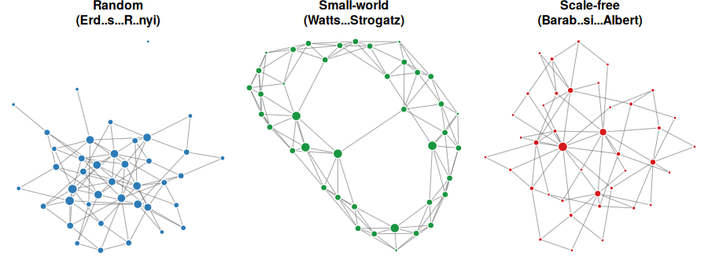</center>

<p><br></p>

The presence of hubs in scale-free networks has a critical implication for epidemiology: even a small $\mathcal{R}_0$ can be sufficient to sustain an epidemic if infection reaches a hub, because the hub can seed many subsequent patches simultaneously. Conversely, targeting hubs with vaccination or quarantine is extremely effective.

**3.1 Think about the flight network between major cities in your region or country. Would you expect it to look more like a random, small-world, or scale-free network? Why? What would be the implication for disease spread?**

```{=html}
<textarea cols="127" rows="4"></textarea>
```
<p><br></p>

---

## Effective distance: the hidden geometry of contagion

::: speaker-note
The Brockmann and Helbing (2013) result is one of the most striking in spatial epidemiology and worth spending a few minutes on. The original paper is open access at [https://doi.org/10.1126/science.1245200](https://doi.org/10.1126/science.1245200){target="_blank"} and Figure 2 shows the transformation from geographic distance to effective distance vividly: what looks like chaotic arrival times on a map becomes a near-perfect cone when plotted against effective distance from the source. If you have time to show this figure it is highly effective. The schematic figure below conveys the same concept more simply. The COVID-19 discussion question (3.2) is usually very productive --- most participants remember the early 2020 news coverage and can recall examples of unexpected early cases.
:::

A striking result from network-based spatial modelling comes from work by [Brockmann and Helbing (2013)](https://doi.org/10.1126/science.1245200){target="_blank"}. They showed that if you replace geographic distance with **effective distance**, a measure based on how strongly two locations are connected by mobility flows, the apparent randomness of epidemic spread disappears. Plotted against effective distance, the arrival times of major outbreaks (including H1N1 influenza) fall on a clean, predictable cone.

The implication is profound: the relevant "geography" for infectious disease spread is not physical space but **mobility network topology**. A city 5,000 km away but connected by a major daily flight may be effectively much closer (in epidemic terms) than a city 200 km away with no direct connection.

<center>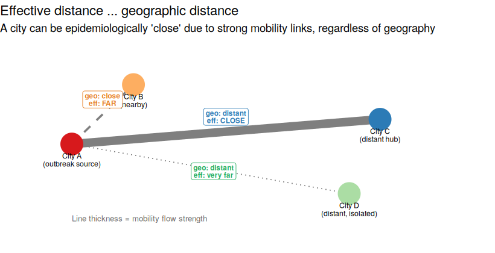</center>

<p><br></p>

The original paper is freely available and its figures are well worth examining: Brockmann, D. & Helbing, D. (2013). The hidden geometry of complex, network-driven contagion phenomena. *Science*, 342, 1337--1342. [https://doi.org/10.1126/science.1245200](https://doi.org/10.1126/science.1245200){target="_blank"}

This reframes how we should think about surveillance and intervention. Rather than asking "which neighbouring regions are at risk?", we should ask "which well-connected regions are at risk?". The answer can look very different on a map.

**3.2 During the early COVID-19 pandemic in 2020, several countries that were geographically distant from China were affected earlier than some of China's immediate neighbours. How does the concept of effective distance help explain this?**

```{=html}
<textarea cols="127" rows="4"></textarea>
```
<p><br></p>

---

## R Practical 3: SIR on a network

::: speaker-note
Allow approximately 20 minutes for this practical. This is a stochastic model, so remind participants upfront that results will differ between runs: that is expected and is itself a learning point (question 3.5). You can use this to show them how to set a random seed too. The degree distribution plot is placed before the epidemic simulation intentionally: participants should understand the structural difference between the two networks before they interpret the epidemic results. The most valuable debrief questions are 3.4 (comparing epidemic curves) and 3.5 (stochastic variation). If time is short, question 3.6 (seeding on a hub) is the one extension worth doing as a group demonstration, because the effect is usually dramatic and makes the hub concept concrete. A note on the code: the simulation uses a discrete-time approximation (probability of infection per step = $\beta$, probability of recovery per step = $\gamma$), which is fine for conceptual demonstration but is not the same as a continuous-time Gillespie simulation. If participants ask about this, acknowledge it and note that for rigorous work you would use a proper continuous-time stochastic algorithm.
:::

We will simulate a stochastic SIR epidemic on two different network types and compare the results. The epidemic is simulated one time step at a time: at each step, each infected node attempts to infect each of its susceptible neighbours with probability $\beta$, and recovers with probability $\gamma$.

**Read through the code and run it, then answer the questions below.**

```{r echo=TRUE, eval=TRUE, message=FALSE}
library(igraph)
library(ggplot2)

# -------------------------------------------------------
# Stochastic SIR on a network
# -------------------------------------------------------
sim_network_sir <- function(g, beta, gamma, seed_node = 1, tmax = 80) {
  n     <- vcount(g)
  state <- rep("S", n)
  state[seed_node] <- "I"

  times <- 0
  S_ts  <- sum(state == "S")
  I_ts  <- sum(state == "I")
  R_ts  <- sum(state == "R")

  t <- 0
  while (sum(state == "I") > 0 && t < tmax) {
    t         <- t + 1
    new_state <- state

    for (v in which(state == "I")) {
      # Each infected node recovers with probability gamma
      if (runif(1) < gamma) {
        new_state[v] <- "R"
        next
      }
      # Each infected node tries to infect susceptible neighbours
      nbrs <- as.integer(neighbors(g, v))
      for (u in nbrs) {
        if (state[u] == "S" && runif(1) < beta) {
          new_state[u] <- "I"
        }
      }
    }

    state <- new_state
    times <- c(times, t)
    S_ts  <- c(S_ts, sum(state == "S"))
    I_ts  <- c(I_ts, sum(state == "I"))
    R_ts  <- c(R_ts, sum(state == "R"))
  }

  data.frame(time = times, S = S_ts, I = I_ts, R = R_ts)
}

# -------------------------------------------------------
# Build networks
# -------------------------------------------------------
set.seed(42)
n_nodes <- 300

# Random (Erdős–Rényi): each pair connected with probability p
g_random <- sample_gnp(n_nodes, p = 0.033)

# Scale-free (Barabási–Albert): preferential attachment, m new edges per node
g_scalefree <- sample_pa(n_nodes, m = 5, directed = FALSE)

cat("Random network    - mean degree:", round(mean(degree(g_random)), 1),
    " max degree:", max(degree(g_random)), "\n")
cat("Scale-free network - mean degree:", round(mean(degree(g_scalefree)), 1),
    " max degree:", max(degree(g_scalefree)), "\n")

# -------------------------------------------------------
# Run epidemics
# -------------------------------------------------------
beta  <- 0.15
gamma <- 0.10

res_random    <- sim_network_sir(g_random,    beta, gamma, seed_node = 1)
res_scalefree <- sim_network_sir(g_scalefree, beta, gamma, seed_node = 1)

# -------------------------------------------------------
# Plot epidemic curves
# -------------------------------------------------------
plot_df <- rbind(
  data.frame(res_random,    network = "Random"),
  data.frame(res_scalefree, network = "Scale-free")
)

ggplot(plot_df, aes(x = time, y = I, colour = network)) +
  geom_line(linewidth = 1) +
  labs(x = "Time step", y = "Number infected",
       colour = "Network type",
       title = "Stochastic SIR on two network types") +
  theme_bw()
```

```{r echo=TRUE, eval=TRUE, message=FALSE}
# -------------------------------------------------------
# Degree distributions
# -------------------------------------------------------
deg_df <- rbind(
  data.frame(degree = degree(g_random),    network = "Random"),
  data.frame(degree = degree(g_scalefree), network = "Scale-free")
)

ggplot(deg_df, aes(x = degree, fill = network)) +
  geom_histogram(bins = 30, alpha = 0.7, position = "identity") +
  facet_wrap(~network, scales = "free") +
  labs(x = "Degree (number of connections)", y = "Count",
       title = "Degree distributions") +
  theme_bw() +
  theme(legend.position = "none")
```

**3.3 Look at the degree distributions. How do they differ between the two network types? What does a long right tail in the scale-free degree distribution mean in practical terms?**

```{=html}
<textarea cols="127" rows="4"></textarea>
```
<p><br></p>

**3.4 Compare the epidemic curves on the two networks. Which produces a faster, larger epidemic? Is this what you expected based on the network structures?**

```{=html}
<textarea cols="127" rows="4"></textarea>
```
<p><br></p>

**3.5 Because this is a stochastic model, different runs produce different results. Change `set.seed(42)` to `set.seed(123)` and re-run. How much do the results change? Try a few different seed values. What does this tell you about drawing conclusions from a single simulation run?**

```{=html}
<textarea cols="127" rows="4"></textarea>
```
<p><br></p>

**3.6 Extension (optional): The scale-free network has a few very high-degree hub nodes. Try seeding the infection on the highest-degree node instead of node 1. Find the highest-degree node with `which.max(degree(g_scalefree))`. How does the epidemic change? Why?**

```{=html}
<textarea cols="127" rows="4"></textarea>
```
<p><br></p>

<p><input type="button" value="Print this page" onClick="window.print()"></p>

## **Part 3:** Solutions

::: {.panel-tabset}

## **Part 3:** Spoiler alert

The solutions tab contains suggested answers for Part 3. **Only click on it if you have tried to complete the exercises yourself and need some help.**

## **Part 3:** Solutions for Part 3

**3.1** In Australia, the domestic flight network is mostly scale-free: Sydney and Melbourne are major hubs with many routes, while smaller cities like Darwin or Hobart have far fewer direct connections. This means that if disease reaches Sydney or Melbourne, it can rapidly seed many other cities simultaneously. Conversely, vaccination or quarantine measures targeted at the major hubs would be highly effective at slowing national spread.

<p><br></p>

**3.2** Countries with strong direct air travel links to China (major European cities, North American hubs, Southeast Asian capitals) received large, regular volumes of travellers from affected regions in January and February 2020. Their effective distance from Wuhan was short despite geographic separation. Conversely, some of China's land-border neighbours had relatively little direct air travel with Wuhan and received fewer seed cases early in the outbreak. In effective distance terms, Paris or New York may have been "closer" to Wuhan than some neighbouring countries.

<p><br></p>

**3.3** The random network has a narrow degree distribution centred around the mean: most nodes have roughly the same number of connections, with very few highly connected nodes. The scale-free network has a long right tail: most nodes have only a few connections, but a small number of hub nodes have very many connections (potentially 50+ in a 300-node network). In practical terms, those hubs could represent major cities or airports: places that, if infected, can seed many other patches very quickly.

<p><br></p>

**3.4** Results will vary between runs, but the scale-free network typically produces a faster-growing epidemic with a sharper peak, because early infection of a hub node immediately exposes many susceptible nodes. The random network epidemic tends to grow more gradually because no node is disproportionately connected. This is consistent with theoretical results showing that scale-free networks amplify epidemic spread relative to random networks with the same mean degree.

To see the distribution of outcomes across many runs, we can overlay multiple simulations using transparency:

```{r echo=TRUE, eval=FALSE}
n_runs <- 50  # number of replicate simulations

# Run multiple simulations and collect results
results_random <- vector("list", n_runs)
results_sf     <- vector("list", n_runs)

for (k in 1:n_runs) {
  results_random[[k]] <- data.frame(
    sim_network_sir(g_random,    beta, gamma, seed_node = 1),
    run     = k,
    network = "Random"
  )
  results_sf[[k]] <- data.frame(
    sim_network_sir(g_scalefree, beta, gamma, seed_node = 1),
    run     = k,
    network = "Scale-free"
  )
}

multi_df <- rbind(
  do.call(rbind, results_random),
  do.call(rbind, results_sf)
)

ggplot(multi_df, aes(x = time, y = I, group = interaction(run, network),
                     colour = network)) +
  geom_line(alpha = 0.15, linewidth = 0.5) +
  scale_colour_manual(values = c("Random" = "#2c7bb6",
                                  "Scale-free" = "#d7191c")) +
  labs(x = "Time step", y = "Number infected",
       colour = "Network type",
       title  = paste0("Stochastic SIR: ", n_runs,
                       " runs on each network type")) +
  theme_bw()
```

With 50 runs the variability between realisations becomes visible, particularly on the scale-free network, where some runs produce large fast epidemics (infection reached a hub early) and others fizzle out or grow slowly (infection stayed in low-degree nodes for many steps). The random network shows much less run-to-run variation. This illustrates why a single stochastic simulation run is rarely sufficient: the distribution of outcomes is as informative as any individual trajectory.

<p><br></p>

**3.5** Changing the random seed does produce different results, and with just a handful of seed values you will likely see runs where the scale-free epidemic is large and fast, and others where it barely takes off. However, manually changing the seed one at a time is an inefficient way to explore this variability. 

As shown in the solution to question 3.4, the better approach is to run many replicates in a loop and plot them together. With 50 or more runs
the full distribution of outcomes becomes clear: the scale-free network shows much wider variation than the random network, with a bimodal-like pattern where epidemics either grow rapidly (infection reached a hub early) or remain small (infection stayed among low-degree nodes). This is a general property of stochastic models on heterogeneous networks: the outcome is highly sensitive to early stochastic events, particularly which node is infected first. In practice you would summarise across many realisations by reporting the median and an uncertainty interval (e.g. the 10th--90th percentile range) of a quantity of interest such as final epidemic size or peak timing, rather than any single trajectory.

<p><br></p>

**3.6** Seeding on the highest-degree hub node typically produces a much larger and faster epidemic on the scale-free network, because that hub is directly connected to many other nodes and can seed a large fraction of the network almost immediately. This is why surveillance and early response at major transport hubs is epidemiologically critical, and why targeted vaccination of highly connected individuals (rather than random vaccination) can be so effective on scale-free networks.

<p><br></p>

:::

---

# **Part 4.** Synthesis

## When to use which spatial model

::: speaker-note
This table is a reference tool and discussion prompt rather than a rigid prescription. Encourage participants to think of it as a set of starting heuristics, not rules. The most useful discussion is usually around the grey areas: what about a disease spread by both local contact and long-distance travel (e.g. measles)? What about a setting where you have no mobility data at all? Walk through the two scenario questions (4.1 and 4.2) as a class if time allows: the contrast between influenza (metapopulation) and Ross River virus (reaction-diffusion) is a good illustration of how different hosts and diseases call for different approaches. Key point to leave participants with: the model choice is a scientific decision that should be justified in any paper or report, not just assumed.
:::

There is no universally "best" spatial model. The right choice depends on the biology of the host, the scale of the question, data availability, and computational resources. Here is a rough guide:

```{r echo=FALSE}
library(kableExtra)
df <- data.frame(
  `Model type` = c("Reaction-diffusion",
                   "Metapopulation (commuter)",
                   "Network",
                   "Agent-based",
                   "Spatial risk mapping"),
  `Best suited to` = c(
    "Animal/plant diseases, vector dispersal, zoonoses with local spread",
    "Human respiratory or vector-borne disease at regional/national scale; commuting data available",
    "STIs and diseases where individual contact heterogeneity matters; identifying hubs for intervention",
    "Diseases where individual behaviour, household structure, or fine-grained heterogeneity is critical",
    "Visualising spatial and potentially spatio-temporal patterns"
  ),
  `Key advantage` = c(
    "Analytical results (wavespeed); intuitive",
    "Maps onto administrative data; tractable for large-scale modelling",
    "Captures heterogeneous connectivity; identifies high-risk nodes",
    "Most biologically realistic",
    "Can build on existing spatial layers such as environmental and ecological data; communicates risk spatially to decision makers"
  ),
  `Key limitation` = c(
    "Local random movement only; poor for modern human populations",
    "Parameter explosion with many patches; assumes well-mixed within patch",
    "Network structure often unknown or time-varying; still requires within-node model",
    "High data and computational demands; hard to identify mechanisms",
    "Spatio-temporal can require interactive interface or video to fully convey meaning; data layers can come with different spatiotemporal resolutions etc requiring interpolation; often sensitive to data quality and climate model uncertainty; can require more computational resources"
  )
)
kbl(df, col.names = c("Model type", "Best suited to",
                       "Key advantage", "Key limitation")) %>%
  kable_styling(bootstrap_options = c("striped", "hover"), full_width = TRUE) %>%
  column_spec(1, bold = TRUE)
```


**3.7 You are asked to model the spread of influenza A across a large region for a coming flu season. Which type of spatial model would you choose, and why? What data would you need to parameterise it?**


```{=html}
<textarea cols="127" rows="4"></textarea>
```
<p><br></p>

**3.8 A colleague wants to model the geographic expansion of a mosquito-borne disease (e.g. Ross River virus, Japanese encephalitis), where spread is driven by the movement of infected *Culex* mosquitoes between wetland habitats. Which spatial approach would be most appropriate, and why?**

```{=html}
<textarea cols="127" rows="4"></textarea>
```
<p><br></p>

---

## What we have not covered

::: speaker-note
This section matters for intellectual honesty and for setting expectations. Participants should leave knowing that this session is an introduction to a large field, not a comprehensive treatment. The most important pointer is to agent-based models (ABMs), since they are the approach most participants will encounter if they read recent high-profile COVID modelling papers (e.g. Ferguson et al. 2020 from Imperial College, or the Doherty Institute modelling for Australia). If ABMs are covered in another session, say so explicitly here. For GIS-based approaches, the R packages `sf`, `spdep`, and `CARBayes` are entry points if participants want to explore further. For those interested in stochastic spatial models, Keeling and Rohani Chapter 7 covers the theory in depth.
:::

This session has introduced three families of spatial model, but the field is broad and there is much we have not had time for. You should be aware that the following approaches exist:

**Agent-based models (ABMs):** Rather than tracking compartments of individuals, ABMs simulate each individual (or agent) explicitly, with their own location, behaviour, and disease state. They are the most biologically detailed approach to spatial modelling and can readily accommodate large movements, heterogeneous behaviour, and complex interventions. The computational cost is high, and interpreting results can be difficult because the sheer complexity of the model makes it hard to identify which mechanisms drive the outcomes. Though it is also important to note that not all ABMs are spatial.

**GIS-based and statistical spatial models:** Spatial regression, geostatistical models, and disease mapping approaches that combine epidemiological data with geographic covariates (land use, temperature, elevation, etc.). These are particularly important for vector-borne diseases where environmental suitability is a key driver. They sit somewhere between statistical analysis and mechanistic modelling.

**Stochastic spatial models:** All three models covered here were deterministic (or, in the case of the network SIR, a simple stochastic approximation). Full stochastic spatial models tend to be more computationally demanding, and particularly stochastic PDEs for continuous space, or exact event-driven simulations for large metapopulations, can be considerably more technically demanding. Though stochastic versions of the discrete models covered here are relatively accessible.

**Higher-dimensional lattice and social structure models:** Lattice models need not represent physical space. A lattice could represent age groups, household types, or social strata, with "movement" between cells reflecting social mixing rather than geography. This blurs the boundary between spatial and heterogeneous-mixing models.

**Dynamic mobility networks:** All the models here treat the contact or travel network as fixed. In reality, mobility patterns change with the seasons, with economic conditions, and especially during outbreaks (as people respond to risk). Incorporating dynamic mobility is an active area of research.

---

<p><input type="button" value="Print this page" onClick="window.print()"></p>

## **Part 4:** Solutions

::: {.panel-tabset}

## **Part 4:** Spoiler alert

The solutions tab contains suggested answers for Part 4. **Only click on it if you have tried to complete the exercises yourself and need some help.**

## **Part 4:** Solutions for Part 4

**4.1** A metapopulation model with one patch per administrative unit (province, state, or country depending on the scale of interest) and a commuter framework would be well suited. You would need: population size per patch; estimates of influenza transmission rates ($\beta$, $\gamma$) and any seasonal forcing parameters relevant to your setting; an inter-patch mobility matrix (from census commuting data, mobile phone data, or airline passenger data depending on the spatial scale); and initial conditions (estimated influenza prevalence at the start of the season in each patch). The model could be fitted to data from previous seasons to estimate parameters and then projected forward. The key modelling decision is the spatial scale: city-level patches are appropriate for within-country spread, while country-level patches are more appropriate for regional or global spread.

<p><br></p>

**4.2** A reaction-diffusion or cellular automata model would be most appropriate here, because the primary driver of spatial spread is local vector movement: a genuinely diffusive process between nearby habitat patches. The relevant spatial scale is the flight range of the mosquito species involved (typically a few kilometres), which is short and local rather than network-structured. A metapopulation with larger patches could also be used if the question is about spread between discrete wetland areas at a regional scale, but the fundamental driver (local insect dispersal) is better captured by a continuous or discretised diffusion model. Environmental covariates such as habitat connectivity, rainfall, and temperature would need to be incorporated to make the model realistic for a specific setting.

<p><br></p>

:::


---

# **Bonus:** Spatial risk mapping

::: speaker-note
This section is genuinely optional and should only be used if time allows or as a take-home reading. It addresses a question that commonly arises at the end of spatial modelling sessions: "but how do we know *where* to apply these models in the first place, and how do we communicate risk spatially?" The three papers here are deliberately chosen to show a progression: dynamic model outputs mapped spatially (Moss et al.), pure ecological risk mapping (Sexton et al.), and a bridge between the two that incorporates vectorial capacity into a spatially explicit framework (Skinner et al.). The interactive map is the centrepiece for in-session use. Question B.1 works well as a brief pair discussion; B.2 is better as a reflective take-home question. If participants ask about the papers, note that Roslyn is a co-author on all three. If participants ask what comes next, it is reasonable to mention that extending the Skinner et al. framework into a full dynamic transmission model is an active area of current research.
:::

::: {.panel-tabset}

# Spatial risk mapping

Throughout this session we have focused on **dynamic** spatial models: given that a disease is present somewhere, how does it spread? But a closely related and practically important question is: **where** should we be looking in the first place, and how do we communicate spatial risk to decision makers?

Spatial risk maps are a common output in applied infectious disease epidemiology. They can be constructed in different ways, and it is worth knowing the main approaches and how they relate to the dynamic models you have built today.


# Spatial risk mapping

## From dynamic models to spatial risk

The first approach constructs a risk surface directly from a **dynamic transmission model**. The model simulates what happens if a pathogen is introduced into different locations, and the outputs (probability of a large outbreak, time to detection, health system capacity to respond) are then mapped spatially.

[Moss et al. (2016)](https://doi.org/10.1371/journal.pntd.0005018){target="_blank"} illustrate this approach in the context of a potential importation of Ebola Virus Disease into the Asia-Pacific region. The framework used a network metapopulation structure directly analogous to the models in Part 3 of this session: countries in the region were nodes, connected by international air travel mobility flows. Stochastic transmission dynamics and health system constraints (detection capacity, isolation capacity, response time) were incorporated for each country. The model was then run repeatedly under different importation scenarios to estimate which countries were at greatest risk of a large uncontrolled outbreak.

The key insight is that **risk here is not about ecological suitability**, it is about the combination of connectivity (how likely is importation?) and response capacity (how able is the health system to contain it?). A country geographically distant from West Africa could be at high risk if it has strong flight connections and a constrained health system. The outputs were mapped across the Asia-Pacific region to produce a spatial risk surface that could directly inform decisions about where to prioritise health system strengthening.

> Moss, R., Hickson, R.I., McVernon, J., McCaw, J.M., Hort, K., Black, J.,
> Madden, J.R., Tran, N.H., McBryde, E.S. & Geard, N. (2016). Model-informed
> risk assessment and decision making for an emerging infectious disease in the
> Asia-Pacific region. *PLOS Neglected Tropical Diseases*, 10(9), e0005018.
> [https://doi.org/10.1371/journal.pntd.0005018](https://doi.org/10.1371/journal.pntd.0005018){target="_blank"}

::: {.panel-tabset}

## Overview

The Moss et al. framework converts dynamic transmission model outputs into
spatial risk estimates. The technical note below outlines the key mathematical
steps.

## Technical note: from transmission model to risk surface

The core challenge is converting the output of a stochastic transmission model
--- which produces a distribution of possible outbreak trajectories --- into a
single spatial risk estimate that is actionable for decision makers. Two
quantities are particularly useful.

### Expected number of importations

The first step is estimating how many infectious individuals are likely to
arrive in a given country per unit time. If $\tau$ is the rate of infectious
travellers departing the source country per day, and $p_i$ is the probability
that a traveller from the source goes to country $i$ (estimated from air travel
data), then the expected daily importation rate into country $i$ is:

$$\mu_i = \tau \cdot p_i$$

This is directly analogous to the $\ell_{ij}$ leaving rates in the metapopulation
model from Part 2. For Ebola in West Africa in 2014--15, $\tau$ was estimated
from reported case counts and known travel volumes, and $p_i$ from airline
passenger data.

### Probability of a major outbreak given importation

Once an infectious individual arrives in country $i$, whether a major outbreak
occurs depends on the local reproduction number $\mathcal{R}_0^{(i)}$ and the
health system's ability to detect and isolate cases quickly. For a simple
branching process model, the probability that a single importation leads to a
major outbreak (rather than dying out stochastically) is approximately:

$$P(\text{major outbreak} \mid \text{importation}) \approx \begin{cases} 1 - \dfrac{1}{\mathcal{R}_{\text{eff}}^{(i)}} & \mathcal{R}_{\text{eff}}^{(i)} > 1 \\ 0 & \mathcal{R}_{\text{eff}}^{(i)} \leq 1 \end{cases}$$

Here $\mathcal{R}_{\text{eff}}^{(i)}$ is the effective reproduction number in country $i$, which is lower than
$\mathcal{R}_0^{(i)}$ if there is either pre-existing immunity or some controls in place.

### Probability of at least one major outbreak in a time window

If importations arrive as a Poisson process with rate $\mu_i$ per day, then
over a time window of $T$ days the expected number of importations is
$\mu_i T$. Each importation independently seeds a major outbreak with
probability $q_i = P(\text{major outbreak} \mid \text{importation})$. The
probability of **at least one** major outbreak in country $i$ over the window
is then:

$$P(\text{outbreak in } i) = 1 - e^{-\mu_i \cdot q_i \cdot T}$$

This is an exponential waiting-time result: the combined rate of
outbreak-seeding events is $\mu_i \cdot q_i$, and the probability of seeing
at least one in time $T$ follows from the Poisson distribution.

### Mapping risk

Evaluating this expression for each country $i$ in the network produces a
scalar risk value between 0 and 1 for each node. These values can then be
mapped spatially: a risk surface derived entirely from the dynamic model.

In the Moss et al. framework, $\mathcal{R}_{\text{eff}}^{(i)}$ was itself
a function of health system capacity: countries with stronger detection and
isolation capacity had lower effective reproduction numbers, and therefore
lower $q_i$. This means the risk surface reflects both the network structure
(who is connected to the source?) and the local response capacity (can the
health system contain what arrives?). Two countries with identical importation
rates can have very different outbreak risks depending on their health systems.


:::

---

## Bridging dynamics and ecology: vectorial capacity frameworks

Between a pure dynamic model and a pure ecological species distribution model (for presence probability) sits an intermediate approach: spatially explicit frameworks that incorporate mechanistic transmission quantities, such as vectorial capacity, into a risk surface derived from species distributions.

.](journal.pntd.0013722.g006.PNG)

[Skinner et al. (2025)](https://doi.org/10.1371/journal.pntd.0013722){target="_blank"} developed exactly this kind of framework for Japanese Encephalitis virus (JEV) in Australia. Rather than simply asking whether mosquitoes, waterbirds, and feral pigs co-occur (an ecological question), they estimated the **vectorial potential** of each *Culex* species at each location based on temperature-dependent mosquito biology, then combined this with host distributions and human population exposure to produce two outputs: an ecological suitability index for JEV, and a spillover potential to human populations if endemic transmission is established.

This is a direct bridge between the ecological risk mapping of Sexton et al. below and a full dynamic transmission model: it asks not just "are the right species here?" but "given the mosquito biology at this location, how efficiently would the virus actually circulate?" The finding that large parts of eastern and southern Australia, including densely populated regions, may be suitable for JEV spillover helps explain why the 2022 outbreak, though unexpected geographically, was not implausible in mechanistic terms.

> Skinner, E.B., Sartorius, B., Furuya-Kanamori, L., Craig, A.T., Kiani, B.,
> Johnson, B.J., Moore, K.T., Hickson, R.I., Mordecai, E.A., Devine, G. &
> Lau, C.L. (2025). Ecological suitability of Japanese encephalitis virus in
> Australia: a modelling analysis of vector-host transmission dynamics to
> potential spillover in humans. *PLOS Neglected Tropical Diseases*, 19(11),
> e0013722.
> [https://doi.org/10.1371/journal.pntd.0013722](https://doi.org/10.1371/journal.pntd.0013722){target="_blank"}

::: {.panel-tabset}

## Overview

The Skinner et al. (2025) framework sits between a pure ecological SDM and a
full dynamic transmission model. Rather than simply asking whether the right
species co-occur, it asks: given the mosquito biology at this location, how
efficiently would JEV actually circulate? The technical note below outlines
the key mathematical quantity and shows how the species distributions feed
through to a spatially explicit spillover risk surface.

## Technical note: vectorial capacity and spillover potential

### Vectorial capacity

The central quantity in the Skinner et al. framework is the **daily vectorial
capacity** $V$, which measures the expected number of infectious bites delivered
to humans per infectious human per day by the local mosquito population. A simpler version from Macdonald (1957, *The Epidemiology and Control of Malaria*. Oxford University Press, London. And more recently the derivation walked through by [Smith and McKenzie](https://doi.org/10.1186/1475-2875-3-13){target="_blank"}) defines this for each location as:

$$V = \frac{m \cdot a^2 \cdot b \cdot c \cdot e^{-g n}}{g}$$

where:

- $m$ is the local mosquito-to-human ratio
- $a$ is the daily biting rate (bites per mosquito per day)
- $b$ is the probability that a bite from an infectious mosquito infects a human
- $c$ is the probability that a bite on an infectious human infects the mosquito
- $g$ is the daily mosquito mortality rate
- $n$ is the extrinsic incubation period (days for the virus to develop in the
  mosquito to the point of infectiousness)
- $e^{-gn}$ is therefore the probability a mosquito survives long enough to
  become infectious

The $e^{-gn}$ term is the key source of nonlinearity. Both $g$ (mortality) and
$n$ (incubation period) are strongly temperature-dependent, so small changes in
temperature can have large effects on vectorial capacity, which is why
temperature range variables dominate the species distribution models in Sexton
et al. A location that is too cool will have mosquitoes that die before the
virus completes its extrinsic incubation period, regardless of how many
mosquitoes are present.

Vectorial capacity is also directly related to $\mathcal{R}_0$ for a
vector-borne disease:

$$\mathcal{R}_0 \propto V$$

so the spatial map of $V$ is essentially a spatial map of transmission potential. Exactly the kind of quantity you would feed into the dynamic models from Parts 1 and 2 of this session.

### From species distributions to spillover potential

The individual species presence probabilities (Figure 7 from Skinner et al) feed directly into
the vectorial capacity calculation: mosquito presence probability scales $m$,
and the waterbird and feral pig distributions determine the availability of
reservoir and amplifying hosts. Combining these with temperature-dependent
estimates of $a$, $g$, and $n$ at each location produces a spatially explicit
vectorial capacity surface. This is then multiplied by human population density
to give the **spillover potential**, the expected transmission risk to humans
given an introduction event (Figure 6).

.*](journal.pntd.0013722.g007.PNG)

### Connection to the dynamic models in this session

The Skinner et al. framework stops short of simulating transmission dynamics. It tells you *where* and *how efficiently* JEV could circulate, but not *how many cases* would result or *how an outbreak would spread* over time. The
natural next step is to use the spatially explicit vectorial capacity surface
as input to a dynamic metapopulation or reaction-diffusion model: each patch
inherits a local $\mathcal{R}_0$ derived from $V$, and the dynamic model then
simulates spread between patches via human movement. This integration of
ecological realism with transmission dynamics is an active area of current
research.

:::
---

## From ecological models to spatial risk

The third approach constructs a risk surface from **species distribution models (SDMs)**: statistical models that estimate the probability of a species being present at a given location based on environmental conditions. For a vector-borne or zoonotic disease, this means modelling the distributions of all the species in the transmission cycle and combining them into a co-occurrence probability.

[Sexton et al. (preprint, 2025)](https://ssrn.com/abstract=5819195){target="_blank"} used Maximum Entropy (MaxEnt) SDMs to estimate the presence probability of each species in the JEV transmission cycle across Australia, then combined these into a **sylvatic co-occurrence probability (CoP)**:

$$P(\text{JEV sylvatic CoP}) = P(\text{mosquito}) \times P(\text{waterbird} \cup \text{feral pig})$$

This was projected forward to 2050 and 2090 under two climate change scenarios (RCP 4.5 and RCP 8.5). Key findings were that coastal regions of high CoP are likely to remain high under both scenarios, that mosquito presence is strongly driven by temperature range and aridity, and that some regional shifts, particularly a decrease in south-western Australia, are consistent across climate models.

> Sexton, J., Golchin, M., Hoskins, A. & Hickson, R.I. (preprint, 2025).
> Japanese Encephalitis Virus sylvatic co-occurrence probabilities under a
> changing climate. SSRN preprint.
> [https://ssrn.com/abstract=5819195](https://ssrn.com/abstract=5819195){target="_blank"}

The interactive map below shows the projected JEV co-occurrence probability across Australia for 2025 (baseline), allowing you to explore the spatial patterns described in the paper.

```{r echo=FALSE, message=FALSE, warning=FALSE}
library(leaflet)
library(terra)

cop <- terra::rast("jev_cop_2025_georef.tif")

pal <- colorNumeric(
  palette  = c("#FFFFFF", "#FFF7BC", "#FEC44F", "#D95F0E", "#7F0000"),
  domain   = c(0, 1),
  na.color = "transparent"
)

leaflet() |>
  addTiles(urlTemplate = "", attribution = "") |>
  setView(lng = 134, lat = -27, zoom = 4) |>
  addRasterImage(cop, colors = pal, opacity = 1.0, project = FALSE) |>
  addLegend(
    position  = "bottomright",
    pal       = pal,
    values    = c(0, 1),
    title     = "JEV Co-occurrence<br>Probability (2025)",
    opacity   = 0.9
  )
```

<p><br></p>

::: speaker-note
The map above uses the actual JEV co-occurrence probability raster from Sexton
et al. (2025), available from the CSIRO Data Access Portal at
[https://doi.org/10.25919/feye-9073](https://doi.org/10.25919/feye-9073){target="_blank"}.
The `terra` and `leaflet` packages are required: add
both to the package check in the session overview facilitator note. The raster
is on an 0.05 decimal degree grid so renders cleanly at national scale without
any resampling.
:::

### Comparing to the Poisson process approach

Both approaches produce a number between 0 and 1 for each location, but they
mean different things:

- The SDM co-occurrence probability $P(\text{JEV CoP})$ asks: *are the right
  ecological conditions present?*
- The dynamic risk $P(\text{outbreak in } i)$ asks: *given the current
  epidemiological situation, will an outbreak occur here within a given
  timeframe?*

The former is relatively stable over time (ecology tends to change slowly, though can be disrupted more quickly with human interventions such as land use changes); the latter can change rapidly as the source outbreak grows or shrinks, as travel patterns
change, or as health systems are strengthened. Both are useful, and both have their place in a comprehensive spatial risk assessment.

---

## A progression of approaches

The three papers above illustrate a natural progression from dynamic modelling toward ecological risk mapping and back again:

| | Moss et al. (2016) | Skinner et al. (2025) | Sexton et al. (2025) |
|---|---|---|---|
| **Disease** | Ebola (potential importation) | JEV (endemic risk) | JEV (endemic risk) |
| **Modelling approach** | Dynamic network metapopulation | SDM + vectorial capacity framework | Species distribution models (MaxEnt) |
| **Risk is defined as** | Probability of uncontrolled outbreak given importation | Ecological suitability index + human spillover potential | Probability of co-occurrence of transmission cycle species |
| **Key drivers** | Connectivity + health system capacity | Mosquito biology + host distributions + human exposure | Climate + ecology |
| **Primary use** | Health system preparedness, resource allocation | Spillover risk mapping, identifying high-risk human populations | Surveillance prioritisation, climate adaptation planning |

The natural next step is to extend the Skinner et al. framework into a full dynamic transmission model: one that not only maps where spillover is ecologically plausible, but simulates how infection would spread through the human population once it arrives. This would close the loop between the ecological and dynamic modelling traditions, combining the spatial realism of SDMs with the transmission dynamics of the models you have built in this session.

---

**B.1 Look at the JEV co-occurrence map above and consider south-eastern Australia. The 2022 outbreak occurred in this region, which the map suggests is only moderate risk. Does this mean the model was wrong? What does it suggest about the limitations of climatological SDMs for predicting outbreak timing?**

```{=html}
<textarea cols="127" rows="4"></textarea>
```
<p><br></p>

**B.2 The Moss et al. (2016) framework used a network metapopulation model similar to Part 3 of this session, but expressed the output as a spatial risk map rather than epidemic curves. What does this change about how the results can be used by decision makers? What is gained and what is lost compared to showing epidemic curves directly?**

```{=html}
<textarea cols="127" rows="4"></textarea>
```
<p><br></p>

> **Further reading:** For a practical introduction to MaxEnt species distribution
> modelling in R, the `dismo` and `ENMeval` packages are good starting points.
> For a worked example combining SDM outputs with dynamic transmission models
> at a global scale, see Messina et al. (2019) on dengue global risk mapping:
> [https://doi.org/10.1038/s41564-019-0476-8](https://doi.org/10.1038/s41564-019-0476-8){target="_blank"}

---

## **Bonus:** Solutions

::: {.panel-tabset}

## **Bonus:** Spoiler alert

The solutions tab contains suggested answers. **Only click on it if you have tried the questions yourself.**

## **Bonus:** Solutions

**B.1** The model was not wrong. It correctly identified that south-eastern Australia has only moderate climatological suitability for the JEV transmission cycle under average conditions. The 2022 outbreak is better understood as a consequence of conditions the SDM does not capture: an exceptionally wet La Niña season in 2021--22 dramatically expanded temporary wetland habitat into southern regions, providing unusually favourable mosquito breeding conditions far beyond their typical range. This is a fundamental limitation of climatological SDMs: they reflect mean or historical climatic conditions and cannot anticipate anomalous years. The model tells you where outbreaks are likely *on average*; it does not tell you when an unusual season will temporarily make an unlikely location hospitable. The Skinner et al. vectorial capacity framework goes some way toward addressing this, since temperature-dependent mosquito biology means that a cooler southern location might still support transmission during an anomalously warm or wet year. A full dynamic model of mosquito population response to rainfall and temperature, layered onto the baseline risk surface, would be the most complete approach.

<p><br></p>

**B.2** Expressing model outputs as spatial risk maps rather than epidemic curves changes the audience and the decision the results can support. Epidemic curves show transmission dynamics, useful for epidemiologists reasoning about intervention timing and magnitude. A spatial risk map shows *where* to act, which is directly actionable for resource allocation: which countries to prioritise for health system strengthening, where to pre-position supplies, where to focus surveillance. The gain is accessibility and actionability for decision makers who are not modellers. The loss is nuance: a risk map collapses the full distribution of modelled outcomes into a single surface, hiding the uncertainty and the dynamic trajectory. A country shown as "high risk" might be high risk because it has high importation probability, or because it has low response capacity, or both, and the intervention implications differ. Showing both the map and the underlying epidemic curves, as Moss et al. do, is the most complete communication strategy.

:::

:::
